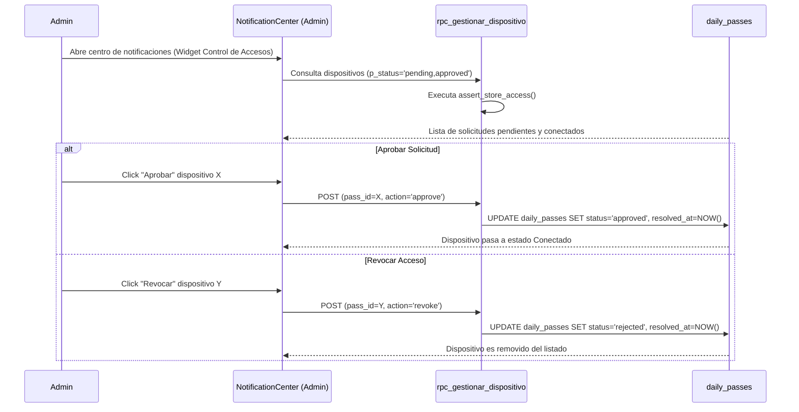
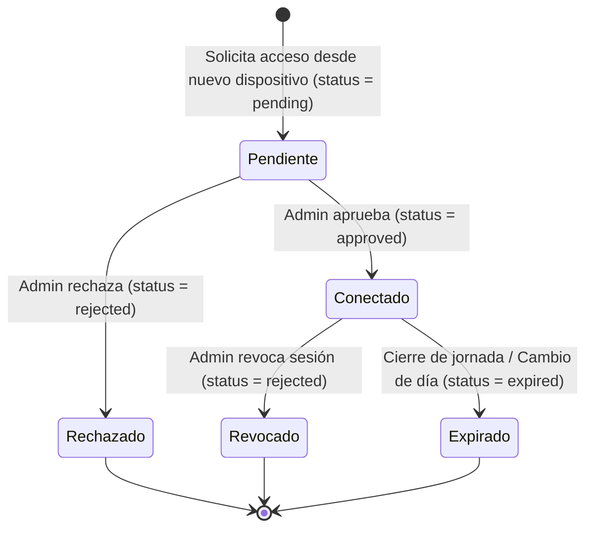
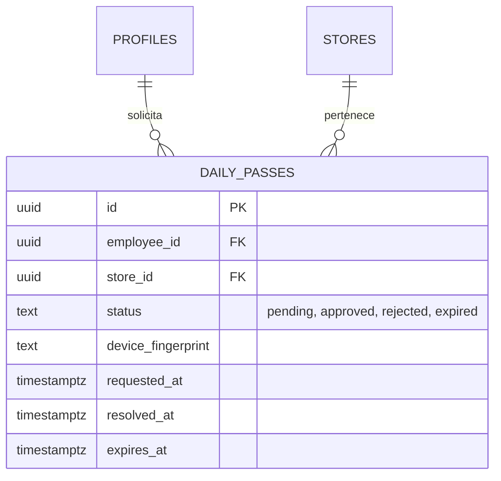

# SDD-015: Gestión Centralizada de Dispositivos y Accesos

> **Asociado a:** [FRD-015](../FRD/FRD_015_GESTION_DISPOSITIVOS.md)  
> **Fase del Plan:** Fase 3 (Prioridad 2 — SDDs Faltantes)  
> **Estado:** 🟡 Validado Localmente (Post Alineación Documental 2026-08-07)  
> **Última Actualización:** 2026-08-07

---

## 0. Contexto y Restricciones Aplicables

### 0.1 Políticas Globales Activadas (ARQ-002)
| Política ID | Dominio | Impacto Concreto en este SDD |
|-------------|---------|------------------------------|
| **POL-SEC-02** | Seguridad | **Zero Trust:** La aprobación o revocación de dispositivos/pases diarios es un privilegio exclusivo del Administrador. |
| **ARQ-002-R4** | Seguridad | **Validación de Tienda:** La consulta y mutación de estados de dispositivos debe invocar `assert_store_access()`. |

### 0.2 Contratos Vecinos que Limitan el Diseño
| SDD Origen | Restricción Inyectada | Impacto en Dispositivos |
|------------|-----------------------|-------------------------|
| **SDD_001 (Zero Trust)** | Utiliza la tabla `daily_passes` para gestionar las solicitudes de acceso por dispositivo. | `SDD_015` expone los contratos RPC para listar, aprobar y revocar los registros de `daily_passes`. |

### 0.3 Auditoría de BD contra Realidad
- **Verificación Real en Esquema:**
  - Tabla `daily_passes` verificada con campos: `id`, `employee_id`, `status` (`'pending'`, `'approved'`, `'rejected'`, `'expired'`), `device_fingerprint`, `requested_at`, `resolved_at`, `expires_at`.

---

## 1. Glosario Local

- **Dispositivo Pendiente:** Registro en `daily_passes` con `status = 'pending'` esperando decisión del Admin.
- **Dispositivo Conectado:** Registro en `daily_passes` con `status = 'approved'` activo durante el turno.
- **Revocación:** Cambio de estado de un pase activo a `'rejected'` o `'expired'`, provocando la expulsión inmediata del dispositivo.

---

## 2. Diagramas de Secuencia

### 2.1 Flujo de Aprobación / Revocación de Dispositivos por el Admin

---

## 3. Diagramas de Estado

---

## 4. Especificación Detallada de Casos de Uso

### Caso A: Gestión Unificada de Accesos en Notificaciones
- **Actor:** Administrador.
- **Precondición:** Existen solicitudes pendientes o dispositivos activos en la tienda.
- **Flujo Principal:**
  1. El Administrador accede al panel de notificaciones.
  2. El sistema renderiza el widget de Control de Accesos en el tope.
  3. Muestra las solicitudes pendientes y los dispositivos actualmente conectados.
  4. El Admin aprueba una solicitud pendiente; el estado en BD pasa a `approved` y el widget se actualiza sin recargar.
  5. El Admin selecciona un dispositivo conectado y presiona "Revocar"; el estado en BD pasa a `rejected`.
- **Postcondiciones (Éxito):** Acceso concedido o revocado inmediatamente.

### Caso B: Auto-Ocultamiento del Widget
- **Actor:** Sistema.
- **Precondición:** El conteo de pases pendientes = 0 Y pases aprobados = 0.
- **Flujo Principal:**
  1. El Admin procesa el último dispositivo en la lista.
  2. El backend confirma la actualización.
  3. El frontend detecta que el arreglo de dispositivos activos/pendientes está vacío.
  4. El widget de Control de Accesos se oculta automáticamente.
- **Postcondiciones:** La interfaz no muestra tarjetas vacías.

---

## 5. Contrato de Interfaz

### Operación: `rpc_gestionar_dispositivo`
- **Entrada esperada:**
  - `p_pass_id` (UUID, obligatorio)
  - `p_action` (TEXT, obligatorio — `'approve'`, `'reject'`, `'revoke'`)
- **Reglas de transformación:**
  - `PERFORM assert_store_access(get_current_store_id())`.
  - Valida que el invocador tenga rol de Administrador.
  - Si `p_action == 'approve'`: SET `status = 'approved'`, `resolved_at = NOW()`.
  - Si `p_action IN ('reject', 'revoke')`: SET `status = 'rejected'`, `resolved_at = NOW()`.
- **Salida esperada:**
  - Éxito: `{ "success": true, "pass_id": "...", "new_status": "..." }`
  - Catálogo de Errores: `PASS_NOT_FOUND`, `UNAUTHORIZED_NOT_ADMIN`.

---

## 6. Análisis de Seguridad

- **Control de Acceso:** Restringido a usuarios con rol `admin` verificado en base de datos. Los empleados que intenten invocar el RPC recibirán un error `403 FORBIDDEN`.
- **Trazabilidad de Auditoría:** Toda aprobación o revocación registra el timestamp `resolved_at` y el `auth.uid()` del Administrador responsable.

---

## 7. Modelo de Datos Lógico

### ERD Mermaid

### Diccionario de Datos

| Atributo | Entidad | Tipo | Restricciones | Descripción |
|----------|---------|------|---------------|-------------|
| `status` | `daily_passes` | TEXT | NOT NULL | Estado del pase (`pending`, `approved`, `rejected`, `expired`). |
| `device_fingerprint` | `daily_passes` | TEXT | NULLABLE | Huella identificadora del dispositivo del empleado. |
