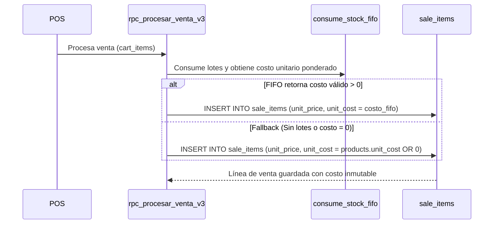
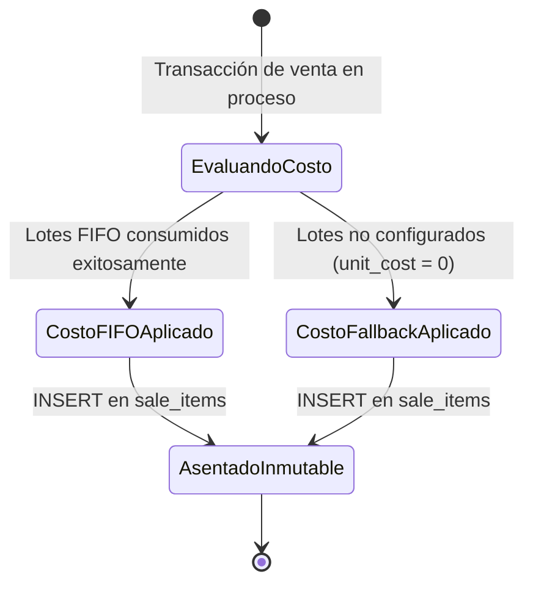
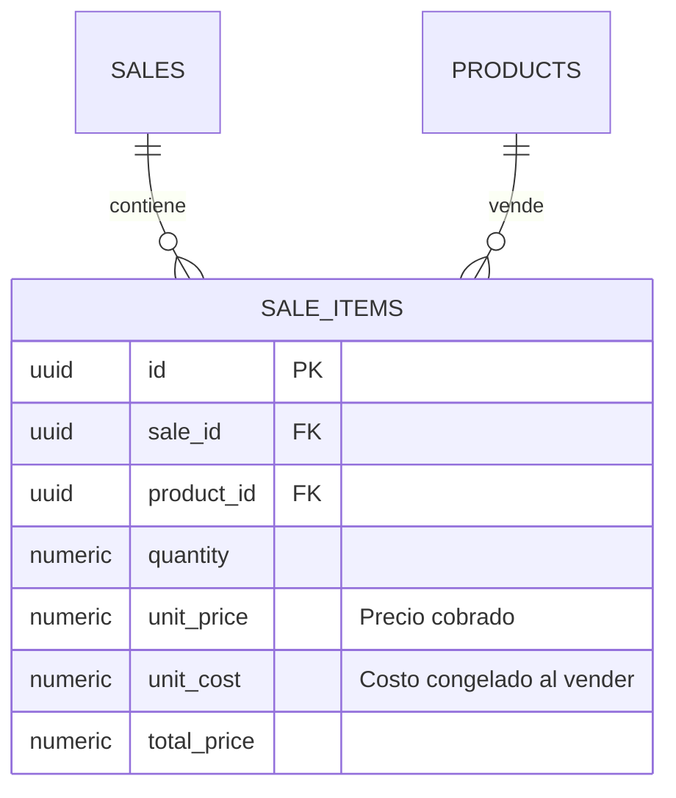

# SDD-016: Registro y Congelamiento de Costo en Ventas (Analytics Enablement)

> **Asociado a:** [FRD-016](../FRD/FRD_016_CORRECCION_COSTO_VENTAS.md)  
> **Fase del Plan:** Fase 3 (Prioridad 3 — SDDs Faltantes)  
> **Estado:** 🟡 Validado Localmente (Post Alineación Documental 2026-08-07)  
> **Última Actualización:** 2026-08-07

---

## 0. Contexto y Restricciones Aplicables

### 0.1 Políticas Globales Activadas (ARQ-002)
| Política ID | Dominio | Impacto Concreto en este SDD |
|-------------|---------|------------------------------|
| **POL-FIN-04** | Financiero | **Inmutabilidad del Costo de Venta:** El costo unitario de cada ítem de venta (`sale_items.unit_cost`) se congela atómicamente al momento de procesar la transacción y jamás se modifica por cambios posteriores en el costo del producto. |
| **POL-AUD-01** | Auditoría | **Transparencia Financiera:** Permite calcular el margen de ganancia real (`total_charged - sum(unit_cost * quantity)`) sin supuestos ficticios. |

### 0.2 Contratos Vecinos que Limitan el Diseño
| SDD Origen | Restricción Inyectada | Impacto en Costeo |
|------------|-----------------------|-------------------|
| **SDD_007_01 (POS)** | `rpc_procesar_venta_v3` calcula y asienta cada línea de venta. | `unit_cost` se inyecta en `sale_items` dentro de la misma transacción PL/pgSQL. |
| **SDD_010_016 (FIFO)** | Motor de consumo por lotes. | `unit_cost` obtiene el valor real consumido de los lotes `inventory_batches` (o fallback a `products.unit_cost`). |

### 0.3 Auditoría de BD contra Realidad
- **Verificación Real en Esquema:**
  - Migración `20260413041000_fix_unit_cost_sale_items.sql` verificada. Tabla `sale_items` posee la columna `unit_cost NUMERIC(12,2) NOT NULL DEFAULT 0`.

---

## 1. Glosario Local

- **Costo Congelado de Venta (`unit_cost`):** Valor de adquisición unitario retenido permanentemente en `sale_items` durante la consolidación de la venta.
- **Fallback de Costo:** Mecanismo defensivo por el cual si el costo FIFO o estándar es NULO o 0, la venta no falla y asienta `unit_cost = 0`.

---

## 2. Diagramas de Secuencia

### 2.1 Flujo de Congelamiento Atómico de Costo en Venta



---

## 3. Diagramas de Estado



---

## 4. Especificación Detallada de Casos de Uso

### Caso A: Congelamiento Exitoso de Costo por Lote
- **Actor:** Sistema / POS Engine.
- **Precondición:** Producto en venta posee lotes con costo registrado en `inventory_batches`.
- **Flujo Principal:**
  1. El usuario procesa la venta desde el POS.
  2. `rpc_procesar_venta_v3` invoca la función FIFO para descontar stock.
  3. La función FIFO calcula el costo unitario ponderado consumido de los lotes.
  4. El RPC asienta en `sale_items` la fila con `unit_price` y `unit_cost`.
- **Postcondiciones (Éxito):** La línea de venta conserva el costo de adquisición real para reportes de P&L.

---

## 5. Contrato de Interfaz

### Regla en `rpc_procesar_venta_v3`
- **Garantía de Inserción:**
  ```sql
  INSERT INTO sale_items (sale_id, product_id, quantity, unit_price, unit_cost, total_price)
  VALUES (v_sale_id, v_product_id, v_quantity, v_unit_price, COALESCE(v_calculated_cost, 0), v_quantity * v_unit_price);
  ```

---

## 6. Análisis de Seguridad

- **Protección de Datos:** `sale_items.unit_cost` solo es expuesto en reportes financieros restringidos a Administrador. Nunca viaja en el payload de respuesta de ticket del cajero.

---

## 7. Modelo de Datos Lógico

### ERD Mermaid


