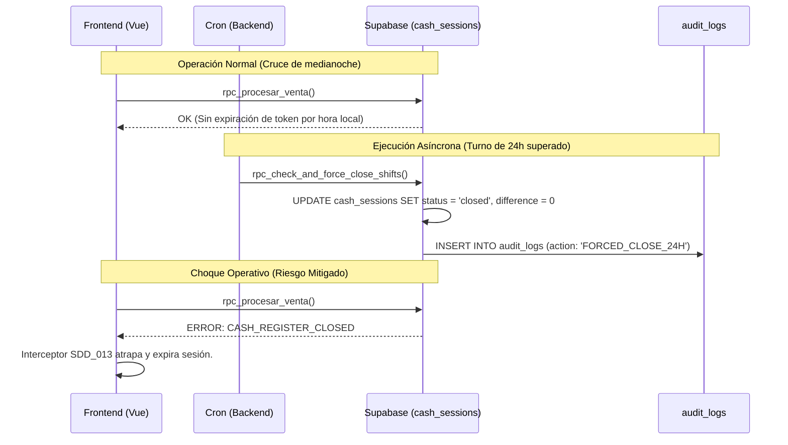
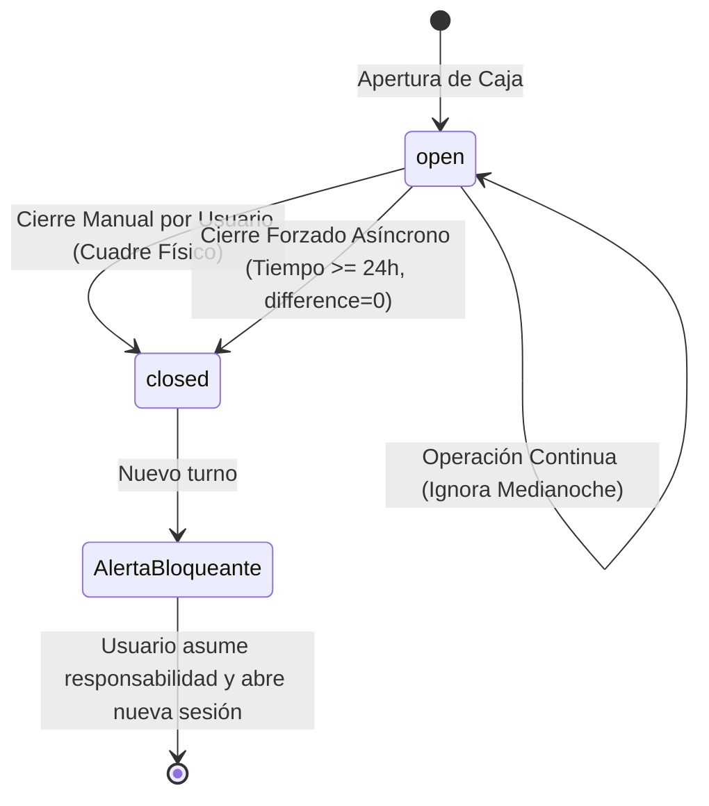

# SDD-017: Ciclo Contable y Sesiones

## § Cabecera

- **FRDs de origen:** [FRD-017](../FRD/FRD_017_CICLO_CONTABLE_Y_SESIONES.md)
- **Fase del Plan:** Fase 6 (Operaciones y Soporte)
- **Estado:** 🟡 Validado PAC-N (Auto-Auditado)
- **Políticas Aplicables:** 
  - **ARQ-002:** Reutilización obligatoria de seguridad centralizada (`assert_store_access`).

## § 0. Contexto y Restricciones (Output del PAC)

- **Brechas de Nomenclatura (Bloque 2):** El FRD hace referencia a `cash_register_id` y `Turno de Caja`. Tras la verificación de esquema real, se dictamina que la entidad base es unívocamente `cash_sessions` y su PK es `id`. El estado lógico (`status`) y el tiempo de apertura (`opened_at`) son los únicos drivers del tiempo contable.
- **Seguridad Centralizada (Bloque 3):** Aunque el cierre de 24 horas es un proceso asíncrono o de sistema, cualquier invocación manual de revisión o despliegue de bloqueos en el cliente invocará funciones que DEBEN envolverse en `assert_store_access`.
- **Impacto Cruzado (Bloque 4):** No se construirá una función nueva para el cierre; se identificó que `rpc_check_and_force_close_shifts` ya existe y muta el estado a `closed`. Se prohíbe alterar su firma para proteger implementaciones multicanal vecinas.
- **Contratos Vecinos (Bloque 5):** Este SDD actúa como el "cerebro" político que une a `SDD_013_GESTION_SESIONES` (interceptores) con `SDD_027_02_LIMITE_24_HORAS` (banners de la UI). Ambos SDDs dictan mecanismos de defensa frontend que son perfectos para el caso de uso del cierre forzado de 24h, sin ninguna incompatibilidad.

## § Glosario Local

- **Cierre Forzado por 24 Horas:** Protocolo de seguridad contable donde un turno que cruza las 24 horas exactas de antigüedad es mutado asíncronamente a estado cerrado, forzando un cuadre matemático perfecto ($0 de diferencia) para proteger la salud de los registros.
- **Cruce de Medianoche Fluido:** Regla contable que dicta que las 00:00 del reloj astronómico carecen de significado para la sesión; el turno de caja (el "Hecho Económico") rige la vida del usuario.

## § Diagrama de Secuencia

## § Diagrama de Estados

## § Especificación Detallada de Casos de Uso

### Caso A: Operación Nocturna (Cruce de Medianoche)
- **Precondiciones:** Caja abierta a las 10:00 PM.
- **Reglas de Negocio:** RN-017-01.
- **Flujo Principal:**
  1. El tendero realiza ventas de 10:00 PM a 02:00 AM.
  2. El sistema nunca expira el JWT ni desloguea al usuario por el cruce del calendario.
  3. Todas las transacciones se asocian al mismo `cash_sessions.id`.
- **Postcondiciones:** La caja cierra con cuadre exacto manual a las 02:00 AM.

### Caso B: Olvido de Cierre y Ejecución Forzada
- **Precondiciones:** Caja abierta el Lunes a las 08:00 AM, abandonada sin cerrar.
- **Reglas de Negocio:** RN-017-02, RN-017-03, RN-017-04.
- **Flujo Principal:**
  1. El Martes a las 08:00 AM (exactamente 24 horas después), `rpc_check_and_force_close_shifts` detecta el exceso de tiempo.
  2. El backend sella la sesión asumiendo matemáticamente `$0` de descuadre.
  3. El backend inyecta un registro en `audit_logs` documentando el cierre por negligencia de tiempo.
  4. Cuando el tendero (o administrador) accede posteriormente al sistema, la UI se sincroniza.
  5. Interceptores de SDD_013 y SDD_027_02 bloquean la interfaz.
- **Postcondiciones:** Contabilidad sellada; el usuario debe purgar el bloqueo mediante un reconocimiento explícito antes de volver a operar.

## § Contrato de Interfaz

### Reglas para Frontend (`auth.ts` y App.vue)
- Se **prohíbe** la implementación de temporizadores vinculados a la hora del dispositivo para expirar sesiones. La vigencia del usuario es un espejo de la vigencia de la `cash_session`.
- Si el backend rechaza una petición con código de cierre o expiración, el frontend acatará inmediatamente con los mecanismos de SDD_013.

### Reglas para Backend (`rpc_check_and_force_close_shifts`)
- La función no requiere modificación de firma, pero contractualmente asume la responsabilidad de barrer las cajas, forzar el estado a `closed` e inyectar el suceso en la auditoría inmutable de la BD.

## § Análisis de Seguridad

- **Integridad Contable vs Negligencia:** Al asentar un `difference = 0` en el cierre forzado, el sistema se protege legal y matemáticamente ante la incapacidad de contar el dinero físico no supervisado. El fraude es mitigado derivando la penalización administrativa al actor que abandonó el turno, según dictado en `audit_logs`.
- **Trazabilidad Inviolable:** El registro en `audit_logs` no puede ser borrado por RLS de usuarios normales, dejando evidencia permanente del cierre forzado.

## § Modelo de Datos Lógico

| Atributo | Entidad | Restricciones Aplicables en Módulo | Descripción |
|---|---|---|---|
| `id` | `cash_sessions` | Primary Key inmutable | Se adosa obligatoriamente a todas las ventas de la sesión. |
| `opened_at` | `cash_sessions` | TIMESTAMP | Base matemática para calcular el offset de 24 horas. |
| `status` | `cash_sessions` | `open` / `closed` | Bandera principal que habilita o corta el JWT/operatividad. |
| `action` | `audit_logs` | TEXT | Guarda el literal estandarizado indicando Cierre Forzoso 24H. |
