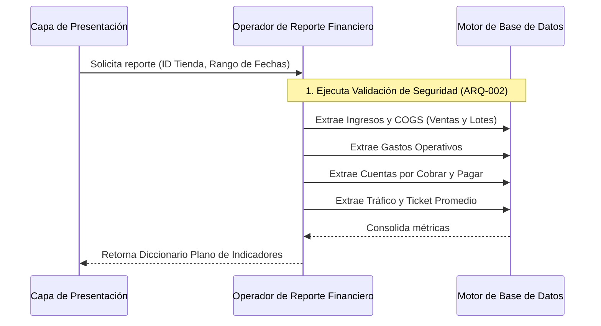

# SDD-018: Control Operacional y Análisis Financiero Integral

## § Cabecera

- **FRDs de origen:** [FRD-018](../FRD/FRD_018_CONTROL_OPERACIONAL_Y_ANALISIS_FINANCIERO.md)
- **Fase del Plan:** Fase 6 (Operaciones y Soporte)
- **Estado:** 🟢 Validado
- **Políticas Aplicables:** 
  - **ARQ-002:** Reutilización obligatoria de seguridad centralizada.

## § Glosario Local

- **P&L (Profit & Loss):** Reporte de rentabilidad que resume Ingresos Netos, Costo de Mercancía (COGS FIFO), Gastos Operativos (OPEX) y la Utilidad Neta real.
- **Working Capital (Capital de Trabajo):** Radiografía de tesorería sumando caja física, cuentas por cobrar, cuentas por pagar e inventario inmovilizado.
- **DIO (Days of Inventory Outstanding):** Indicador de cuántos días en promedio tarda la tienda en rotar el valor de su inventario.
- **Autoridad del Backend:** Todo cálculo matemático recae en el servidor. La capa cliente asume rol de presentación.

## § Diagrama de Secuencia

## § Especificación Detallada de Casos de Uso

### Caso 1: Generación de Reporte Financiero Integral
- **Precondiciones:** El usuario tiene sesión activa y rol autorizado.
- **Reglas de Negocio Aplicables:** Políticas de cálculo de COGS FIFO, formato de moneda según estándar.
- **Flujo Principal:**
  1. El sistema cliente solicita las métricas operacionales de un periodo.
  2. El servidor valida la pertenencia de la solicitud al tenant del usuario.
  3. El servidor totaliza ingresos netos omitiendo transacciones anuladas.
  4. El servidor totaliza el costo exacto consumido desde el registro de lotes de inventario.
  5. El servidor totaliza egresos clasificados como gasto.
  6. El servidor calcula la ganancia neta.
  7. El servidor calcula saldos de tesorería (deudas a favor y en contra).
  8. El servidor calcula métricas de eficiencia (ticket promedio).
  9. El servidor retorna el compendio consolidado.
- **Postcondiciones (Éxito):** El cliente recibe el dictamen financiero para renderizado.

## § Contrato de Interfaz

### Operación: Extracción de Reporte Financiero
- **Entrada esperada:** 
  - Identificador lógico de la tienda (Requerido).
  - Fecha de inicio (Opcional, por defecto fecha actual).
  - Fecha de fin (Opcional, por defecto fecha actual).
- **Reglas de transformación / cálculo:**
  - **Ingresos Netos:** Suma de ventas donde la anulación es falsa.
  - **COGS (Costo de Ventas):** Sumatoria del costo almacenado en los lotes consumidos (FIFO).
  - **OPEX (Gastos):** Suma de movimientos financieros catalogados como gasto.
  - **Net Profit:** Ingresos Netos restando COGS y OPEX.
  - **Cuentas por Cobrar:** Suma de saldos vigentes de clientes.
  - **Cuentas por Pagar:** Suma de facturas pendientes de proveedores.
- **Salida esperada:** Un diccionario plano estructurado con las métricas absolutas calculadas y el estado semántico de salud ("verde", "amarillo", "rojo") para delegar el renderizado.

## § Análisis de Seguridad

- **Control de Acceso:** La operación invocará inamoviblemente el validador central de tienda como primera instrucción. Los usuarios sin permisos de lectura financiera recibirán un rechazo de autorización.
- **Protección de Datos:** Toda consulta a las entidades contables DEBE incluir el filtro de aislamiento de tenant.
- **Superficie de Amenazas:** 
  - *Amenaza:* Denegación de servicio (DoS) por peticiones de rangos temporales masivos.
  - *Mitigación:* El operador debe truncar o rechazar peticiones cuyo rango temporal exceda un año.
- **Trazabilidad de Auditoría:** La solicitud de reportes de sólo lectura no muta estado, por lo que no requiere registro de auditoría estricto, salvo las métricas de rendimiento interno.

## § Modelo de Datos Lógico

*(No se introducen entidades nuevas, se consumen entidades transaccionales y de inventario existentes)*
