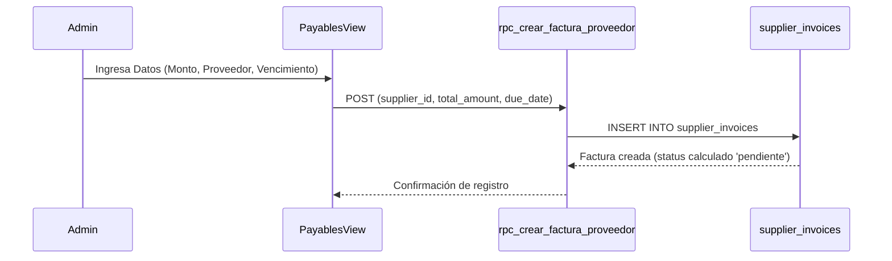
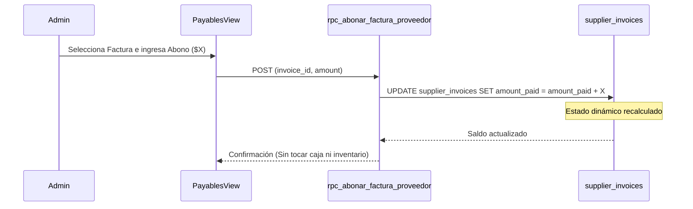

# SDD-019: Módulo de Cuentas por Pagar (Mecánica Técnica)

> **Asociado a:** [FRD-019](../FRD/FRD_019_CUENTAS_POR_PAGAR.md)  
> **Fase del Plan:** Fase 3 (Deudas y Crédito)  
> **Estado:** 🟡 Validado Localmente (Post Alineación Documental 2026-08-07)  
> **Última Actualización:** 2026-08-07

---

## 0. Contexto y Restricciones Aplicables

### 0.1 Políticas Globales Activadas (ARQ-002)
| Política ID | Dominio | Impacto Concreto en este SDD |
|-------------|---------|------------------------------|
| **POL-FIN-02** | Financiero | **Aislamiento Contable:** El módulo de Cuentas por Pagar es un registro independiente. Los abonos ingresados no afectan el saldo de la caja ni el flujo de caja del POS. |
| **POL-LOG-02** | Logística | **Aislamiento Logístico:** Se prohíben triggers o automatizaciones que creen facturas de proveedor a partir de entradas de inventario o que apliquen deducciones por devoluciones. |

### 0.2 Restricciones Transversales Inyectadas
| SDD Origen | Restricción Inyectada | Impacto en Pagos |
|------------|-----------------------|------------------|
| **SDD_003 (ILC)** | Independencia Logística-Contable. | La recepción física de mercancía es independiente del registro de deudas. |

---

## 1. Responsabilidad Lógica: Registro Independiente ("Libreta Digital")

Este SDD especifica la arquitectura del módulo de Cuentas por Pagar como un repositorio aislado de consulta y registro manual. 

- **PROHIBICIÓN:** El sistema NO creará ni modificará facturas de proveedor automáticamente desde `inventory_movements`.
- **PROHIBICIÓN:** Registrar abonos en este módulo NO generará movimientos en `cash_movements` ni descontará dinero de la caja diaria.

---

## 2. Modelado de Operaciones

### 2.1 Registro Manual de Factura

### 2.2 Registro Manual de Abono

---

## 3. Estructura de Datos y Reglas de Negocio

### 3.1 Campos Dinámicos (Anti-Desincronización)
La tabla `supplier_invoices` **tiene prohibido** poseer una columna física `status` (`vencida`, `pagada`, `pendiente`). El estado se calcula dinámicamente en tiempo de consulta:
- `PAGADA`: `amount_paid >= total_amount`
- `VENCIDA`: `due_date < CURRENT_DATE` AND `amount_paid < total_amount`
- `PENDIENTE`: `due_date >= CURRENT_DATE` AND `amount_paid < total_amount`

### 3.2 Idempotencia (Autoridad del Backend — Decisión D-04)
El registro de facturas y abonos cuenta con la protección de restricción `UNIQUE` en la base de datos para prevenir duplicación por reintentos de red. La responsabilidad recae en la base de datos, no en la UI.

