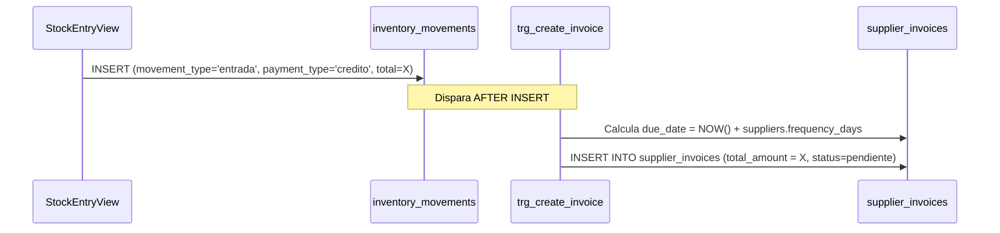
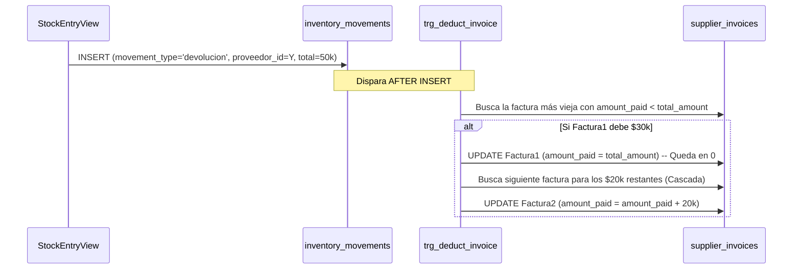

# SDD-019: Módulo de Cuentas por Pagar (Mecánica Técnica)

> **Asociado a:** [FRD-019](../FRD/FRD_019_CUENTAS_POR_PAGAR.md)  
> **Fase del Plan:** Fase 3 (Deudas y Crédito)  
> **Estado:** 🟡 Validado Localmente (Post PEA-N v1.0)  
> **Última Actualización:** 2026-08-04

---

## 0. Contexto y Restricciones Aplicables (PEA-N)

### 0.1 Políticas Globales Activadas (ARQ-002)
| Política ID | Dominio | Impacto Concreto en este SDD |
|-------------|---------|------------------------------|
| **POL-FIN-01** | Financiero | Fidelidad al Flujo. El acto de "pagar" a un proveedor requiere forzosamente sacar dinero físico/digital de la caja del día. |
| **POL-LOG-01** | Logística | Aislamiento Logístico. El nacimiento de la deuda (factura) y la reducción (devolución) ocurren directamente en la bodega (Triggers de inventario). |

### 0.2 Restricciones Transversales Inyectadas (Fase 0)
| SDD Origen | Restricción Inyectada | Impacto en Pagos |
|------------|-----------------------|------------------|
| **SDD_027 (Caja Multicanal)** | Prevención de Sobregiro por Canal. | Cualquier RPC que manipule facturas y extraiga liquidez DEBE descontarlo de `cash_session_balances` bajo un `payment_method_id` explícito, bloqueando la transacción si los fondos de ESE canal son insuficientes. |

### 0.3 Auditoría de BD contra Realidad (Deuda Técnica Crítica)
La auditoría revela que el módulo de "Cuentas por Pagar" (FRD-019) **no ha sido implementado en absoluto a nivel de base de datos**, dejando los flujos descritos en el FRD como promesas vacías.

| Hallazgo / Componente | Brecha Descubierta | Solución Obligatoria (DSD/SQL) |
|-----------------------|--------------------|--------------------------------|
| 🔴 Triggers de Facturación (Rama A) | No existe el trigger `AFTER INSERT` en `inventory_movements` para crear automáticamente las facturas en `supplier_invoices` cuando `payment_type = 'credito'`. | Crear función y trigger `trg_create_supplier_invoice_on_credit` que lea el monto de la entrada y lo inserte como deuda. |
| 🔴 Triggers de Devolución (Rama B) | No existe el algoritmo de "Cascada FIFO" para rebajar facturas cuando se devuelve mercancía al proveedor. | Crear función y trigger `trg_deduct_supplier_invoice_on_return` que descuente el valor devuelto de la factura más antigua no pagada. |
| 🔴 `rpc_pay_supplier_invoice` | Como se documentó en `SDD-025`, el RPC extrae dinero en un vacío contable (sin canal, sin validación de 24h, sin validación de fondos multicanal). | Reescribir el RPC para inyectar el parámetro `p_payment_method_id` y transar contra `cash_session_balances`. |

---

## 1. Responsabilidad Lógica: El Motor de Autómatas

Este SDD define los "Autómatas" (Triggers de Postgres) que unen la logística con las finanzas. 
El usuario nunca interactúa directamente con la tabla `supplier_invoices` para crear o rebajar facturas. Todo es gobernado por los movimientos de inventario (`inventory_movements`). 
La única intervención humana en la tabla de facturas es **El Abono** (El pago físico de la deuda).

---

## 2. Modelado de Flujos y Triggers

### 2.1 Autómata de Creación de Deuda (Trigger A)

### 2.2 Autómata de Devolución Cascada FIFO (Trigger B)

Si se devuelve mercancía que estaba fiada, la tienda ya no debe ese dinero. El sistema debe bajar la deuda sin tocar la caja.

---

## 3. Estructura de Datos Modificada

### 3.1. Campos dinámicos (Anti-Desincronización)
La tabla `supplier_invoices` **tiene prohibido** poseer una columna `status` (`vencida`, `pagada`). El estado se calcula en tiempo de ejecución:
- `PAGADA`: `amount_paid >= total_amount`
- `VENCIDA`: `due_date < CURRENT_DATE` y no pagada.
- `PENDIENTE`: `due_date >= CURRENT_DATE` y no pagada.

### 3.2. Idempotencia y UI
Como lo advierte el FRD-019, la base de datos aún no cuenta con `idempotency_key` en los movimientos de inventario. El Frontend (`StockEntryView` y `PayablesView`) es 100% responsable de bloquear el botón de Submit (`isSubmitting = true`) para evitar la creación de facturas duplicadas o pagos dobles por latencia de red.
