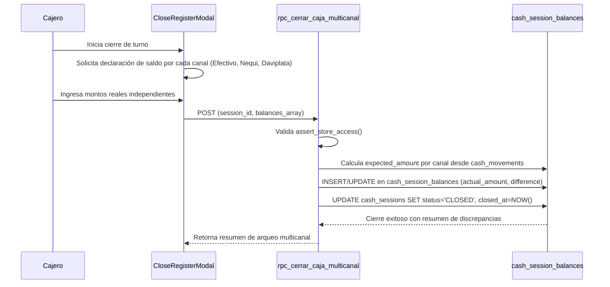
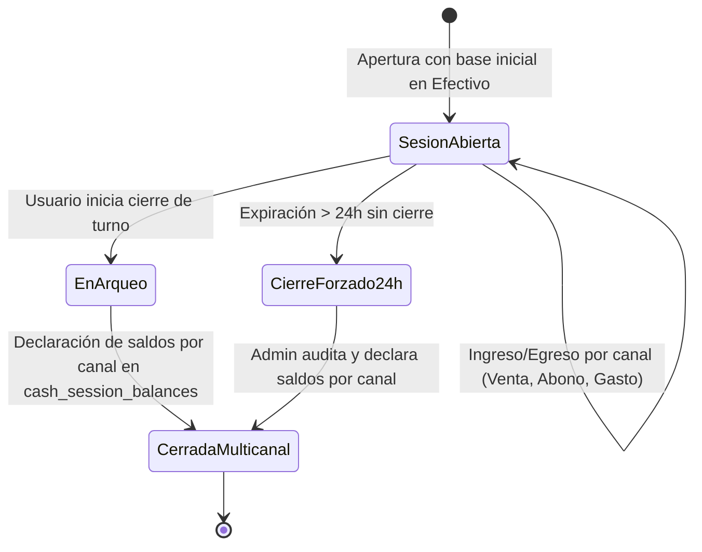
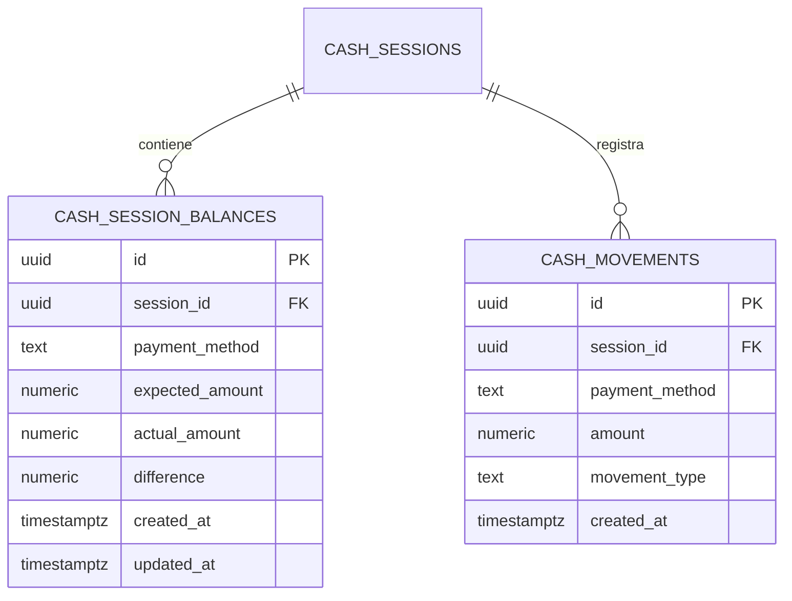

# SDD-020: Control de Caja Multicanal (Físico y Digital)

> **Asociado a:** [FRD-020](../FRD/FRD_020_CAJA_MULTICANAL.md)  
> **Fase del Plan:** Fase 3 (Prioridad 1 — SDDs Faltantes)  
> **Estado:** 🟡 Validado Localmente (Post Alineación Documental 2026-08-07)  
> **Última Actualización:** 2026-08-07

---

## 0. Contexto y Restricciones Aplicables

### 0.1 Políticas Globales Activadas (ARQ-002)
| Política ID | Dominio | Impacto Concreto en este SDD |
|-------------|---------|------------------------------|
| **POL-SEG-01** | Seguridad | **Arqueo Ciego Multicanal:** Al cerrar la caja o auditar un turno expirado, el sistema exige declarar el saldo real independientemente por cada canal activo (Efectivo, Nequi, Daviplata, etc.) sin revelar previamente el saldo esperado. |
| **POL-AUTH-01** | Seguridad | **Erradicación del PIN:** Todo control de acceso y firma de arqueo se autentica mediante la sesión/token principal y funciones centralizadas (`assert_store_access`). |

### 0.2 Contratos Vecinos que Limitan el Diseño
| SDD Origen | Restricción Inyectada | Impacto en Caja Multicanal |
|------------|-----------------------|----------------------------|
| **SDD_004 (Control de Caja)** | Unicidad de sesión abierta por tienda. | La apertura multicanal aplica a la única sesión activa (`session_id`). |
| **SDD_007_01 (POS)** | Obligatoriedad del canal de pago. | Todo cobro de venta declara `payment_method_id` hacia `cash_movements`. |
| **SDD_009 (Clientes)** | Abonos con canal obligatorio. | Todo abono de cartera incrementa el `expected_amount` del canal específico seleccionado. |

### 0.3 Auditoría de BD contra Realidad
- **Verificación Real en Esquema (`20260727000000_multichannel_schema.sql`):**
  - Tabla `cash_session_balances` verificada con columnas: `id`, `session_id`, `payment_method`, `expected_amount`, `actual_amount`, `difference`, `created_at`, `updated_at`. Restricción `UNIQUE(session_id, payment_method)`.
  - Tabla `cash_movements` verificada con columna `payment_method` (`TEXT NOT NULL DEFAULT 'efectivo'`).

---

## 1. Glosario Local

- **Canal de Pago / Método de Pago (`payment_method`):** Medio por el cual ingresa o egresa liquidez en la tienda (Efectivo, Nequi, Daviplata, Transferencia Bancaria).
- **Balance por Canal (`cash_session_balances`):** Registro individualizado del saldo esperado, saldo real declarado y discrepancia para un canal específico dentro de una sesión de caja.
- **Arqueo Multicanal:** Proceso de conteo y declaración independiente de dinero físico y digital por cada canal operativo utilizado en la sesión.

---

## 2. Diagramas de Secuencia

### 2.1 Flujo de Cierre de Caja Multicanal (Arqueo Ciego)

---

## 3. Diagramas de Estado

---

## 4. Especificación Detallada de Casos de Uso

### Caso A: Cierre de Turno Multicanal Regular
- **Actor:** Empleado con permiso `canOpenCloseCash`.
- **Precondición:** Existe una sesión de caja en estado `OPEN` con movimientos registradas en múltiples canales.
- **Flujo Principal:**
  1. El cajero selecciona "Cerrar Turno".
  2. El sistema identifica los canales activos que tuvieron movimientos en la sesión.
  3. El sistema presenta campos de entrada independientes para cada canal (sin revelar saldos esperados).
  4. El cajero ingresa el conteo físico para Efectivo y los saldos reportados en las plataformas digitales (Nequi, Daviplata, etc.).
  5. El cajero confirma el cierre.
  6. El backend calcula la discrepancia (`difference = actual_amount - expected_amount`) por cada canal de forma atómica.
  7. El backend actualiza la sesión a `CLOSED` y asienta los balances en `cash_session_balances`.
- **Postcondiciones:** Turno cerrado con trazabilidad de discrepancias por canal.

### Caso B: Cierre Forzado Multicanal a 24 Horas
- **Actor:** Administrador.
- **Precondición:** Existe una sesión caducada (`opened_at < NOW() - INTERVAL '24 hours'`) en estado `OPEN`.
- **Flujo Principal:**
  1. El Administrador inicia sesión en la aplicación.
  2. El sistema detecta el turno expirado y despliega forzosamente el modal de auditoría de cierre.
  3. El modal lista los canales con movimientos de esa sesión.
  4. El Admin ingresa los saldos reales verificados para cada canal.
  5. El backend ejecuta el cierre forzado mediante `rpc_check_and_force_close_shifts`, asentando los balances multicanal en `cash_session_balances`.
- **Postcondiciones:** Turno caducado cerrado y archivado correctamente; navegación liberada.

---

## 5. Contrato de Interfaz

### Operación: `rpc_cerrar_caja_multicanal`
- **Entrada esperada:**
  - `p_session_id` (UUID, obligatorio)
  - `p_balances` (JSONB Array, obligatorio) — Estructura: `[{ "payment_method": "efectivo", "actual_amount": 150000 }, { "payment_method": "nequi", "actual_amount": 45000 }]`
- **Reglas de transformación:**
  - Invoca `PERFORM assert_store_access(store_id_de_sesion)`.
  - Recorre los canales activos de `cash_movements` para la sesión dada, calculando `expected_amount = SUM(amount)` por cada `payment_method`.
  - Por cada elemento en `p_balances`, realiza `UPSERT` en `cash_session_balances` registrando `expected_amount`, `actual_amount` y `difference = actual_amount - expected_amount`.
  - Actualiza `cash_sessions`: `status = 'CLOSED'`, `closed_at = NOW()`.
- **Salida esperada:**
  - Éxito: `{ "success": true, "session_id": "...", "balances": [...] }`
  - Catálogo de Errores: `SESSION_NOT_FOUND`, `SESSION_ALREADY_CLOSED`, `UNAUTHORIZED_STORE_ACCESS`, `INVALID_PAYMENT_METHOD`.

---

## 6. Análisis de Seguridad

- **Control de Acceso:** Validación obligatoria mediante `assert_store_access()` en todas las funciones RPC multicanal.
- **Protección de Datos:** Los saldos esperados se calculan en el servidor y jamás se envían a la UI antes de la declaración del arqueo.
- **Superficie de Amenazas:**
  - *Amenaza:* Declaración de saldos negativos o datos malformados en `p_balances`.
  - *Mitigación:* Validación estricta en el RPC: `actual_amount >= 0`. Desglose obligatorio para todo canal con movimientos.

---

## 7. Modelo de Datos Lógico

### ERD Mermaid

### Diccionario de Datos (Verificado en `20260727000000_multichannel_schema.sql`)

| Atributo | Entidad | Tipo | Restricciones | Descripción |
|----------|---------|------|---------------|-------------|
| `session_id` | `cash_session_balances` | UUID | FK `cash_sessions(id)`, NOT NULL | Identificador de la sesión de caja. |
| `payment_method` | `cash_session_balances` | TEXT | NOT NULL | Canal de pago (efectivo, nequi, daviplata). |
| `expected_amount` | `cash_session_balances` | NUMERIC(12,0) | NOT NULL, DEFAULT 0 | Saldo calculado por el sistema en la sesión. |
| `actual_amount` | `cash_session_balances` | NUMERIC(12,0) | NULLABLE | Saldo real declarado por el usuario. |
| `difference` | `cash_session_balances` | NUMERIC(12,0) | NULLABLE | Discrepancia calculada (`actual - expected`). |
