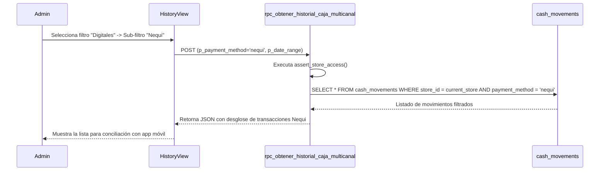
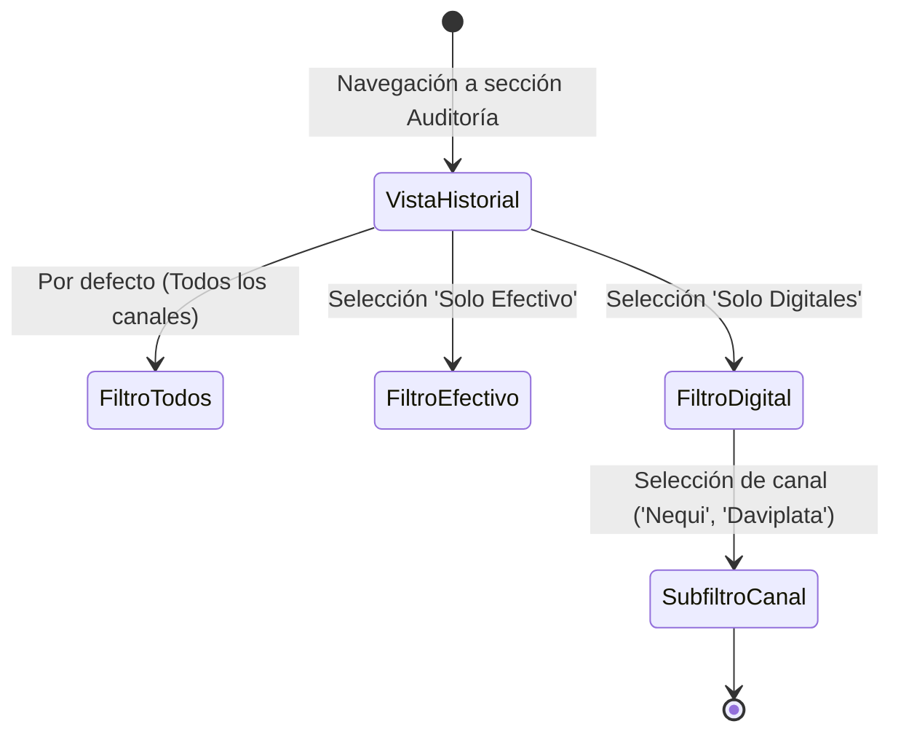
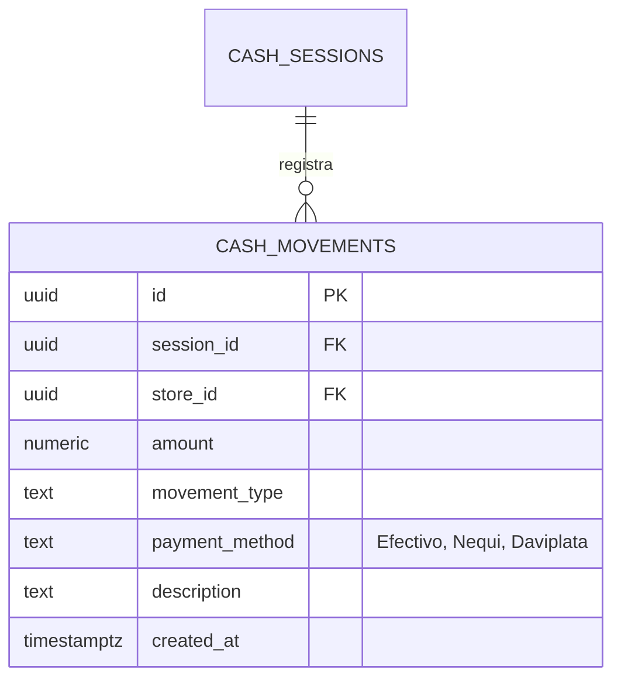

# SDD-021: Auditoría de Movimientos Multicanal

> **Asociado a:** [FRD-021](../FRD/FRD_021_HISTORIALES_MULTICANAL.md)  
> **Fase del Plan:** Fase 3 (Prioridad 1 — SDDs Faltantes)  
> **Estado:** 🟡 Validado Localmente (Post Alineación Documental 2026-08-07)  
> **Última Actualización:** 2026-08-07

---

## 0. Contexto y Restricciones Aplicables

### 0.1 Políticas Globales Activadas (ARQ-002)
| Política ID | Dominio | Impacto Concreto en este SDD |
|-------------|---------|------------------------------|
| **POL-AUD-02** | Auditoría | **Trazabilidad por Canal:** Toda consulta de historial de caja debe permitir filtrar por `payment_method` específico o tipo de canal (Físico/Digital). |
| **ARQ-002-R4** | Seguridad | **Reutilización de Funciones:** La consulta de historiales debe ejecutar `assert_store_access()` y filtrar mediante `get_current_store_id()`. |

### 0.2 Contratos Vecinos que Limitan el Diseño
| SDD Origen | Restricción Inyectada | Impacto en Historiales |
|------------|-----------------------|------------------------|
| **SDD_020 (Caja Multicanal)** | Toda transacción asienta `payment_method` en `cash_movements`. | Los historiales consumen el campo `payment_method` directamente de `cash_movements`. |
| **SDD_005 (Trazabilidad)** | Inmutabilidad de los registros históricos. | Los historiales son de lectura pura (append-only en BD). |

### 0.3 Auditoría de BD contra Realidad
- **Verificación Real en Esquema (`20260727000000_multichannel_schema.sql`):**
  - Tabla `cash_movements` verificada con columna `payment_method` (`TEXT NOT NULL DEFAULT 'efectivo'`).

---

## 1. Glosario Local

- **Filtro Primario:** Selector de nivel alto ('Todos', 'Solo Efectivo', 'Solo Digitales').
- **Sub-filtro Digital:** Selección específica del canal electrónico ('Nequi', 'Daviplata', 'Bancolombia', 'Tarjeta').

---

## 2. Diagramas de Secuencia

### 2.1 Flujo de Consulta Filtrada por Canal Digital

---

## 3. Diagramas de Estado

---

## 4. Especificación Detallada de Casos de Uso

### Caso A: Conciliación de Movimientos Nequi
- **Actor:** Administrador / Cajero con permisos.
- **Precondición:** Existen movimientos de efectivo y Nequi en la sesión activa o histórica.
- **Flujo Principal:**
  1. El usuario navega al historial de caja.
  2. Selecciona la categoría "Digitales" y marca "Nequi".
  3. La UI llama a `rpc_obtener_historial_caja_multicanal`.
  4. El backend retorna exclusivamente los registros donde `payment_method = 'nequi'`.
  5. El usuario compara los totales devueltos con la aplicación de Nequi.
- **Postcondiciones (Éxito):** Conciliación efectuada sin interferencia de dinero en efectivo.

---

## 5. Contrato de Interfaz

### Operación: `rpc_obtener_historial_caja_multicanal`
- **Entrada esperada:**
  - `p_session_id` (UUID, opcional — si se omite usa rango de fechas)
  - `p_payment_method` (TEXT, opcional — null o 'all' para todos, 'efectivo', 'nequi', 'daviplata', etc.)
  - `p_start_date` (TIMESTAMPTZ, opcional)
  - `p_end_date` (TIMESTAMPTZ, opcional)
- **Reglas de transformación:**
  - `PERFORM assert_store_access(get_current_store_id())`.
  - Construye consulta sobre `cash_movements` filtrando por `store_id` y `payment_method` (si se especifica).
- **Salida esperada:**
  - Arreglo JSON de movimientos con: `id`, `session_id`, `amount`, `movement_type`, `payment_method`, `description`, `created_at`.

---

## 6. Análisis de Seguridad

- **Control de Acceso:** Uso estricto de `assert_store_access()` y RLS en `cash_movements`.
- **Protección de Datos:** Las consultas son de solo lectura y están restringidas a la tienda del usuario autenticado.

---

## 7. Modelo de Datos Lógico

### ERD Mermaid

### Diccionario de Datos

| Atributo | Entidad | Tipo | Restricciones | Descripción |
|----------|---------|------|---------------|-------------|
| `payment_method` | `cash_movements` | TEXT | NOT NULL, DEFAULT 'efectivo' | Identificador del canal de pago del movimiento. |
