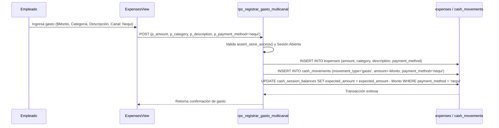
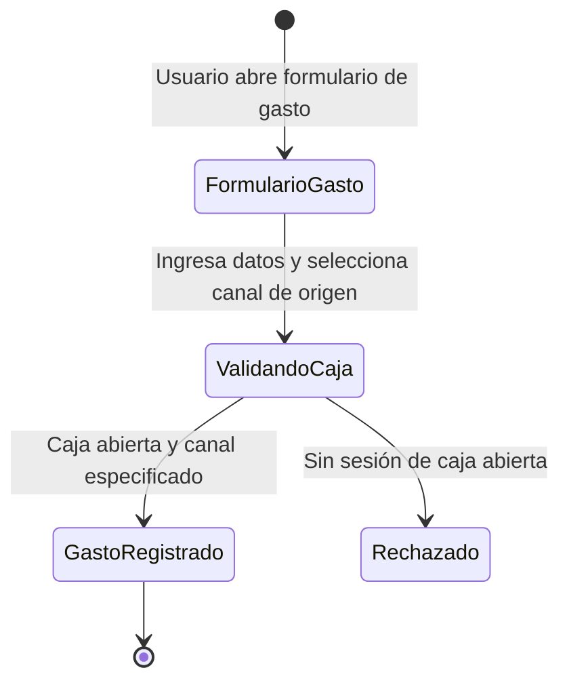
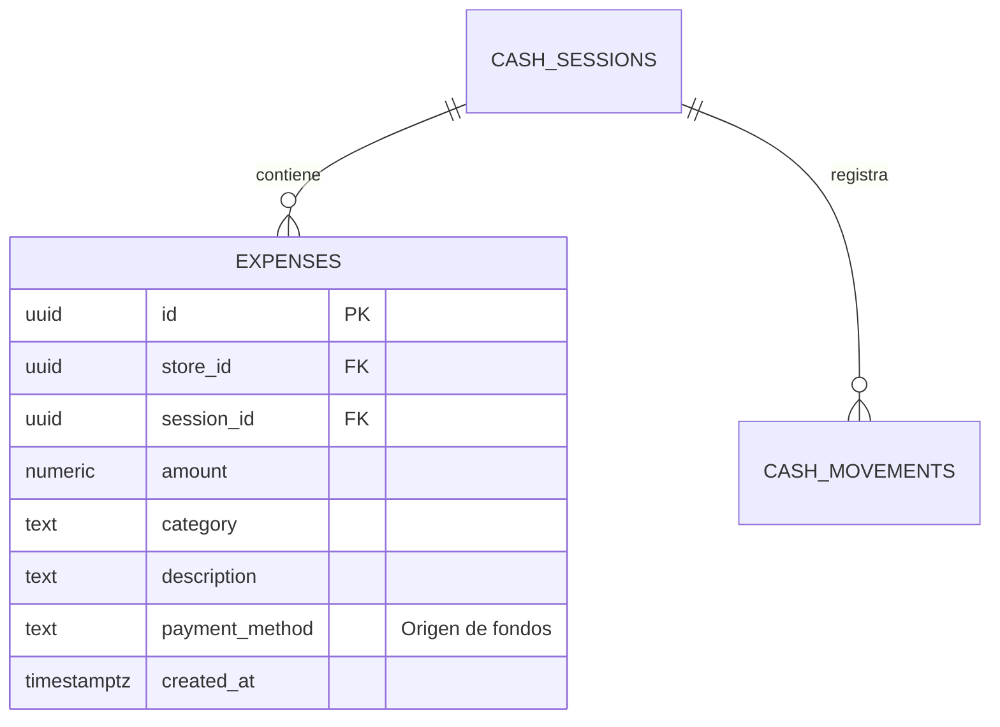

# SDD-022: Gastos Operativos Multicanal

> **Asociado a:** [FRD-022](../FRD/FRD_022_GASTOS_MULTICANAL.md)  
> **Fase del Plan:** Fase 3 (Prioridad 1 — SDDs Faltantes)  
> **Estado:** 🟡 Validado Localmente (Post Alineación Documental 2026-08-07)  
> **Última Actualización:** 2026-08-07

---

## 0. Contexto y Restricciones Aplicables

### 0.1 Políticas Globales Activadas (ARQ-002)
| Política ID | Dominio | Impacto Concreto en este SDD |
|-------------|---------|------------------------------|
| **POL-FIN-03** | Financiero | **Afectación de Canal Específico:** Toda salida de dinero por gastos del negocio (`expenses`) debe especificar el canal de origen (`payment_method`) y restar del `expected_amount` exclusivo de ese canal. |
| **ARQ-002-R4** | Seguridad | **Validación de Tienda:** El registro de gastos ejecuta `assert_store_access()` y valida que exista una sesión de caja abierta (`status = 'OPEN'`). |

### 0.2 Contratos Vecinos que Limitan el Diseño
| SDD Origen | Restricción Inyectada | Impacto en Gastos |
|------------|-----------------------|-------------------|
| **SDD_020 (Caja Multicanal)** | `cash_session_balances` desglosa `expected_amount` por `payment_method`. | El registro de un gasto resta del `expected_amount` del canal correspondiente en `cash_session_balances`. |
| **SDD_004 (Control de Caja)** | Exige sesión en estado `OPEN`. | Bloquea la inserción de gastos si no hay caja abierta. |

### 0.3 Auditoría de BD contra Realidad
- **Verificación Real en Esquema:**
  - Tabla `expenses` verificada con columnas: `id`, `store_id`, `session_id`, `amount`, `category`, `description`, `payment_method`, `created_at`.
  - Tabla `cash_movements` asienta el egreso con `movement_type = 'gasto'` y `payment_method`.

---

## 1. Glosario Local

- **Gasto Operativo (`expenses`):** Egreso de liquidez destinado a cubrir costos operativos inmediatos de la tienda (Servicios, Arriendo, Almuerzo, Transporte).
- **Origen de Fondos:** Canal de pago del cual se extrajo el dinero para cubrir el gasto (Efectivo físico del cajón o transferencia digital).

---

## 2. Diagramas de Secuencia

### 2.1 Flujo de Registro de Gasto Multicanal

---

## 3. Diagramas de Estado

---

## 4. Especificación Detallada de Casos de Uso

### Caso A: Registro de Gasto Pagado con Nequi
- **Actor:** Empleado / Administrador con permisos.
- **Precondición:** Existe una sesión de caja en estado `OPEN`.
- **Flujo Principal:**
  1. El usuario accede al formulario de registrar gasto.
  2. Ingresa el monto (Ej. $20.000), categoría ("Servicios"), descripción ("Pago servicio internet").
  3. Selecciona "Nequi" en el campo Origen de Fondos.
  4. Envía la solicitud.
  5. El backend verifica acceso y valida que la caja esté abierta.
  6. El backend inserta en `expenses` e inserta el egreso en `cash_movements` etiquetado con `payment_method = 'nequi'`.
  7. El backend resta $20.000 del `expected_amount` del canal Nequi en `cash_session_balances`. El saldo de Efectivo permanece inalterado.
- **Postcondiciones (Éxito):** Gasto registrado con trazabilidad de origen; arqueo de efectivo físico no es afectado.

---

## 5. Contrato de Interfaz

### Operación: `rpc_registrar_gasto_multicanal`
- **Entrada esperada:**
  - `p_amount` (NUMERIC, obligatorio, > 0)
  - `p_category` (TEXT, obligatorio)
  - `p_description` (TEXT, obligatorio)
  - `p_payment_method` (TEXT, obligatorio — 'efectivo', 'nequi', 'daviplata', etc.)
- **Reglas de transformación:**
  - `PERFORM assert_store_access(get_current_store_id())`.
  - Verifica `cash_sessions` en estado `OPEN`.
  - Inserta en `expenses` y `cash_movements`.
  - Descuenta del saldo esperado del canal en `cash_session_balances`.
- **Salida esperada:**
  - Éxito: `{ "success": true, "expense_id": "..." }`
  - Catálogo de Errores: `NO_OPEN_CASH_SESSION`, `INVALID_PAYMENT_METHOD`, `INVALID_AMOUNT`.

---

## 6. Análisis de Seguridad

- **Control de Acceso:** Invocación protegida con `assert_store_access()`.
- **Protección contra Fraude:** Obligatoriedad de seleccionar canal y justificación mediante `description`.

---

## 7. Modelo de Datos Lógico

### ERD Mermaid

### Diccionario de Datos

| Atributo | Entidad | Tipo | Restricciones | Descripción |
|----------|---------|------|---------------|-------------|
| `amount` | `expenses` | NUMERIC(12,2) | NOT NULL, > 0 | Monto del gasto registrado. |
| `payment_method` | `expenses` | TEXT | NOT NULL | Canal de pago de origen de los fondos. |
| `category` | `expenses` | TEXT | NOT NULL | Categoría del gasto (Servicios, Nómina, etc.). |
