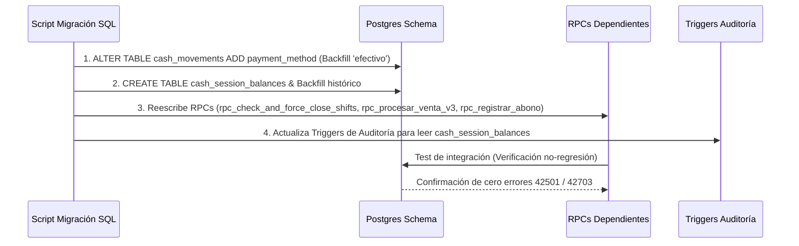
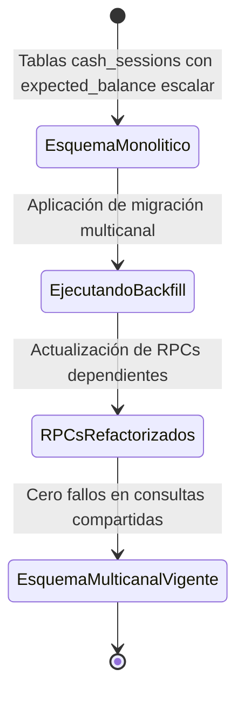
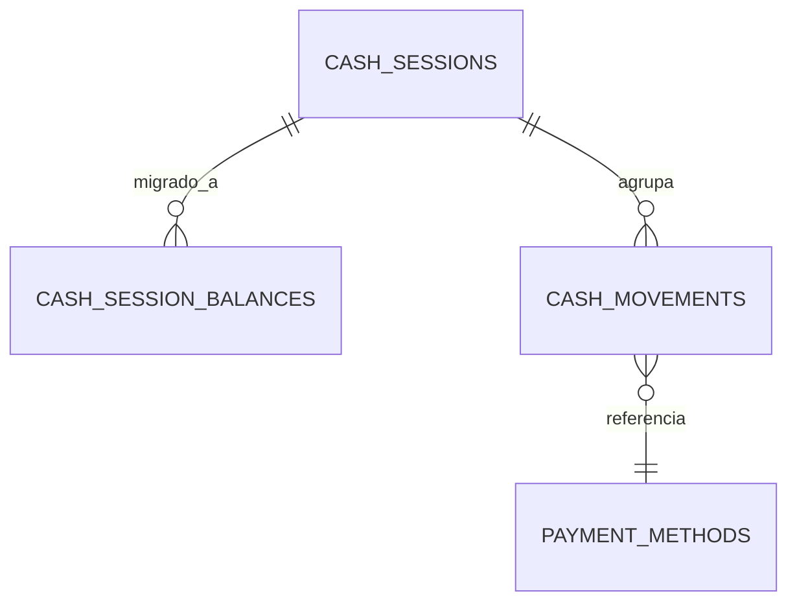

# SDD-023: Matriz de Impacto Cruzado - Caja Multicanal

> **Asociado a:** [FRD-023](../FRD/FRD_023_IMPACTO_CRUZADO_MULTICANAL.md)  
> **Fase del Plan:** Fase 3 (Prioridad 2 — SDDs Faltantes)  
> **Estado:** 🟡 Validado Localmente (Post Alineación Documental 2026-08-07)  
> **Última Actualización:** 2026-08-07

---

## 0. Contexto y Restricciones Aplicables

### 0.1 Políticas Globales Activadas (ARQ-002)
| Política ID | Dominio | Impacto Concreto en este SDD |
|-------------|---------|------------------------------|
| **ARQ-002-R6** | Arquitectura | **Auditoría de Impacto Cruzado Obligatoria:** Ninguna migración o cambio de tipo en tablas compartidas (como `cash_sessions` o `cash_movements`) se considera completa sin listar y verificar la no-rotura de funciones dependientes. |
| **POL-AUD-01** | Auditoría | Preservación de la historia: Los datos históricos de sesiones anteriores a la migración multicanal deben ser migrados (*backfill*) sin pérdida ni corrupción. |

### 0.2 Contratos Vecinos que Limitan el Diseño
| SDD Origen | Restricción Inyectada | Impacto en Matriz Cruzada |
|------------|-----------------------|---------------------------|
| **SDD_020 (Caja Multicanal)** | Introduce la tabla `cash_session_balances` y obliga `payment_method` en `cash_movements`. | Todos los RPCs de mutación financiera deben actualizar su contrato. |
| **SDD_005 (Trazabilidad)** | Triggers de auditoría en `cash_sessions`. | Los triggers de auditoría deben rediseñarse para consumir la nueva tabla multicanal. |

### 0.3 Auditoría de BD contra Realidad
- **Verificación Real en Esquema:**
  - Migración `20260727000000_multichannel_schema.sql` ejecuta backfill de `payment_method = 'efectivo'` en `cash_movements` y puebla `cash_session_balances` para sesiones históricas.

---

## 1. Glosario Local

- **Matriz de Impacto Cruzado:** Registro auditable de todas las dependencias y funciones RPC/Triggers que resultan afectadas por una modificación en el esquema de datos compartido.
- **Backfill Retroactivo:** Inserción o actualización asistida de registros históricos para adaptar datos del esquema antiguo al esquema nuevo sin romper la integridad.

---

## 2. Diagramas de Secuencia

### 2.1 Flujo de Ejecución de Migración y Verificación de No-Regresión

---

## 3. Diagramas de Estado

---

## 4. Especificación Detallada de Casos de Uso

### Caso A: Verificación de No-Regresión en Cierre Forzado 24h
- **Actor:** Sistema / Administrador.
- **Precondición:** Existe un turno expirado con movimientos multicanal.
- **Flujo Principal:**
  1. El sistema invoca `rpc_check_and_force_close_shifts`.
  2. El RPC agrupa los movimientos de `cash_movements` por `payment_method`.
  3. Inserta un registro en `cash_session_balances` por cada canal activo con su `expected_amount`.
  4. Actualiza `cash_sessions.status = 'CLOSED'`.
- **Postcondiciones (Éxito):** La caja forzada se cierra sin romper consultas de reportes ni omitir canales digitales.

---

## 5. Contrato de Interfaz (Matriz de Funciones Afectadas)

| Nombre de Función / RPC | Tipo de Impacto | Acción Requerida | Estado de Verificación |
|-------------------------|-----------------|------------------|------------------------|
| `rpc_check_and_force_close_shifts` | Modificación de Inserción | Agrupar `cash_movements` por `payment_method` e insertar en `cash_session_balances`. | ✅ Refactorizado en migración |
| `rpc_procesar_venta_v3` | Firma e Inserción | Exigir `payment_method_id` e insertar egreso/ingreso etiquetado en `cash_movements`. | ✅ Especificado en DSD_007_01_v3 |
| `rpc_registrar_abono` | Firma e Inserción | Requerir `payment_method` e inyectar en `cash_movements`. | ✅ Refactorizado en SDD_009 |
| `rpc_get_comprehensive_financial_report` | Consulta P&L | Verificar no-regresión al consultar `cash_movements` con el nuevo campo. | ✅ Sin romper |
| Triggers de Auditoría | Audit Log | Rediseñar para capturar desde `cash_session_balances`. | ✅ Refactorizado |

---

## 6. Análisis de Seguridad

- **Integridad de Datos:** Garantizada mediante `UNIQUE(session_id, payment_method)` en `cash_session_balances`.
- **Control de Acceso:** Mantenimiento inalterado de `assert_store_access()` en todas las funciones refactorizadas.

---

## 7. Modelo de Datos Lógico (Impacto Cruzado)

