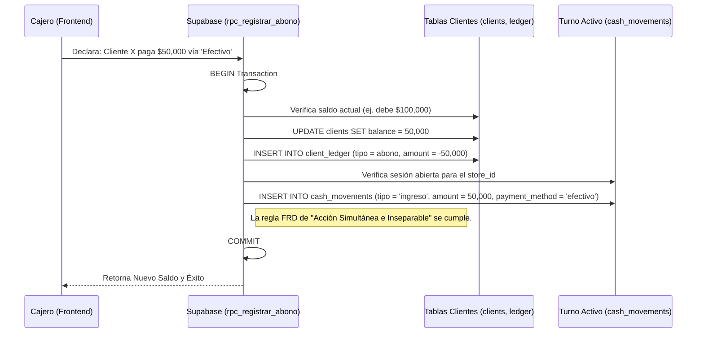

# SDD-024: Política de Fiados y Cuentas por Cobrar

> **Asociado a:** [FRD-024](../FRD/FRD_024_POLITICA_FIADOS_CLIENTES.md)  
> **Fase del Plan:** Fase 3 (Deudas y Crédito)  
> **Estado:** 🟡 Validado Localmente (Post PEA-N v1.0)  
> **Última Actualización:** 2026-08-04

---

## 0. Contexto y Restricciones Aplicables (PEA-N)

### 0.1 Políticas Globales Activadas (ARQ-002)
| Política ID | Dominio | Impacto Concreto en este SDD |
|-------------|---------|------------------------------|
| **POL-FIN-01** | Financiero | Fidelidad al flujo puro. Prohibido sumar el valor de un fiado a los ingresos del día en la caja. El fiado es solo una promesa virtual. |
| **POL-LOG-01** | Logística | Sincronicidad de Inventario. Aunque el fiado no mueva dinero, el producto sale físicamente. El motor de inventario debe rebajar el stock en tiempo real. |

### 0.2 Restricciones Transversales Inyectadas (Fase 0)
| SDD Origen | Restricción Inyectada | Impacto en Fiados |
|------------|-----------------------|-------------------|
| **SDD_027 (Caja Multicanal)** | Inyección estricta a canales. | Cuando el cliente paga su deuda (abono), el dinero entra a caja. Este SDD **prohíbe** inyectar el abono de forma genérica; debe especificarse el canal (`payment_method_id`) por donde entra el pago. |
| **SDD_007_01 (POS Engine)** | Único punto de salida. | La creación de la deuda nace EXCLUSIVAMENTE en el RPC de ventas (`rpc_procesar_venta`). No existen "fiados manuales" desconectados de una venta. |

### 0.3 Auditoría de BD contra Realidad (Deuda Técnica Crítica)
La auditoría revela que la base de datos actual posee una fuga masiva de capital (dinero "fantasma" que nunca ingresa a la tienda).
| Hallazgo / Función | Brecha Descubierta | Solución Obligatoria (DSD/SQL) |
|--------------------|--------------------|--------------------------------|
| 🔴 `registrar_abono` | Rebaja la deuda del cliente y registra el ledger, **PERO NO inyecta el dinero en la caja diaria**. El abono desaparece contablemente del turno actual. | El RPC debe reescribirse para: 1. Requerir `p_payment_method`. 2. Buscar la sesión abierta. 3. Insertar el ingreso en `cash_movements`. |
| 🔴 Falta de Canal | El RPC de abonos asume que el pago es "mágico". | Modificar la firma del RPC para recibir obligatoriamente el canal financiero. |

---

## 1. Responsabilidad Lógica: La Bandeja de Promesas

El ecosistema de fiados no opera como dinero. Opera como un "banco de memoria" que registra cuánto debe un cliente a la tienda. 

**Existen dos momentos aislados:**
1. **La Promesa (Nacimiento):** Una venta se cierra como `p_payment_method = 'fiado'`. El POS entrega la mercancía (baja inventario), pero no inyecta nada a la caja. Solo incrementa el `balance` del cliente.
2. **La Liquidación (Abono):** El cliente regresa con dinero real (efectivo o transferencia). Al procesar este evento, la deuda baja, y la liquidez se inyecta por fin en el turno activo.

---

## 2. Modelado de Flujos

### 2.1 Flujo de Recuperación de Cartera (El Abono)

Este diagrama modela la corrección a la deuda técnica encontrada. Muestra cómo un abono inyecta liquidez en el ecosistema Multicanal.

---

## 3. Contrato de Datos (Interfaz RPC)

Para que el flujo sea seguro, la interfaz del backend debe exponer la siguiente firma estructural.

### 3.1. Firma: `rpc_registrar_abono` (Refactorización Obligatoria)

| Parámetro | Tipo | Obligatorio | Descripción |
|-----------|------|-------------|-------------|
| `p_client_id` | UUID | Sí | Cliente que abona. |
| `p_amount` | Decimal | Sí | Cantidad del abono (> 0 y <= saldo adeudado). |
| `p_payment_method` | String | Sí | Canal (Efectivo, Nequi, etc). Si no hay turno abierto para este canal, el RPC debe fallar. |
| `p_store_id` | UUID | Sí | Validar pertenencia. |

---

## 4. Análisis de Seguridad

- **Integridad Transaccional:** Si la caja está caducada (Límite 24H) o cerrada, el RPC `registrar_abono` intentará insertar el movimiento en la caja, pero será rechazado por los triggers defensivos de la caja. Toda la transacción de abono se revierte (Rollback), impidiendo que el cliente baje su deuda si el dinero no pudo ingresar legalmente a la tienda.
- **Abonos Excesivos (Anti-Lavado/Descuadre):** El RPC incluye validación defensiva estricta: `p_amount` no puede ser matemáticamente superior a `v_client.balance`. Un cliente no puede tener "saldo a favor" en este módulo.
