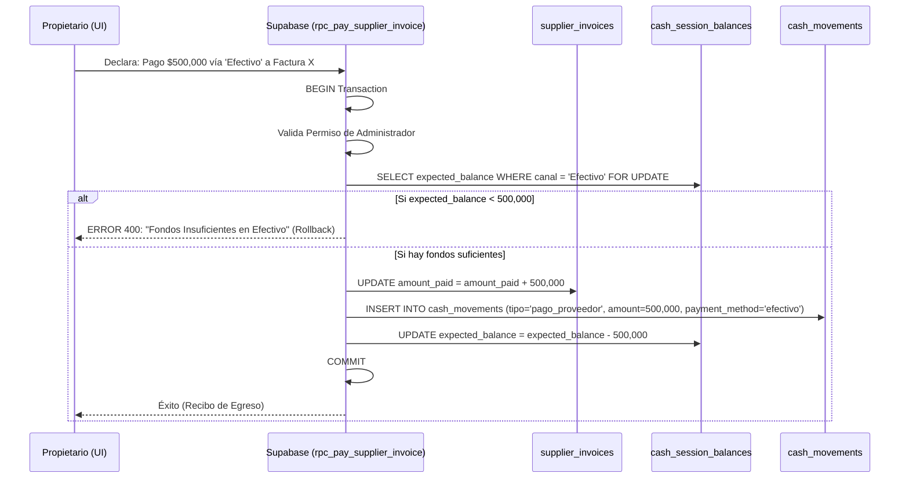

# SDD-025: Política de Deudas a Proveedores (Cuentas por Pagar)

> **Asociado a:** [FRD-025](../FRD/FRD_025_POLITICA_DEUDAS_PROVEEDORES.md)  
> **Fase del Plan:** Fase 3 (Deudas y Crédito)  
> **Estado:** 🟡 Validado Localmente (Post PEA-N v1.0)  
> **Última Actualización:** 2026-08-04

---

## 0. Contexto y Restricciones Aplicables (PEA-N)

### 0.1 Políticas Globales Activadas (ARQ-002)
| Política ID | Dominio | Impacto Concreto en este SDD |
|-------------|---------|------------------------------|
| **POL-FIN-01** | Financiero | Simetría Financiera. La recepción de una factura no impacta la caja hasta que exista un desembolso físico o digital. |
| **POL-LOG-01** | Logística | Sincronicidad de Inventario. La recepción de la mercancía incrementa el inventario en tiempo real, independientemente del plazo de pago de la factura. |

### 0.2 Restricciones Transversales Inyectadas (Fase 0)
| SDD Origen | Restricción Inyectada | Impacto en Proveedores |
|------------|-----------------------|------------------------|
| **SDD_027 (Caja Multicanal)** | Extracción estricta por canales y Prevención de Sobregiro. | El pago de una factura a un proveedor TIENE PROHIBIDO extraer dinero de una "bolsa global". Debe extraerlo de un canal específico (`payment_method_id`) y el sistema debe abortar la operación si el canal no tiene fondos suficientes (`expected_balance < p_amount`). |

### 0.3 Auditoría de BD contra Realidad (Deuda Técnica Crítica)
La auditoría revela que el módulo de pago a proveedores es un "caballo de Troya" para generar saldos negativos (sobregiros) en la caja.
| Hallazgo / Función | Brecha Descubierta | Solución Obligatoria (DSD/SQL) |
|--------------------|--------------------|--------------------------------|
| 🔴 `rpc_pay_supplier_invoice` | Inserta un egreso en `cash_movements` asumiendo caja única. **No exige canal ni valida fondos**. Esto permite pagarle al proveedor un millón de pesos en efectivo, incluso si la gaveta de efectivo está vacía. | 1. Modificar la firma para recibir `p_payment_method`.   2. Buscar `cash_session_balances` para ese canal.   3. Hacer `IF expected_balance < p_amount THEN RAISE EXCEPTION 'SOBREGIRO'`. |
| 🔴 Validación de 24 Horas | El RPC no verifica si la sesión `OPEN` ha excedido las 24 horas antes de extraer el dinero. | Añadir la validación `now() - opened_at > 24h` y abortar con `SHIFT_EXPIRED`. |

---

## 1. Responsabilidad Lógica: Bandeja de Obligaciones

A diferencia de los Fiados, las Cuentas por Pagar son pasivos. Sin embargo, arquitectónicamente se modelan idéntico a las Cuentas por Cobrar: operan en un ecosistema informativo, aisladas de la liquidez real.

**Momentos del Pasivo:**
1. **La Adquisición (Entrada Logística):** Se registra la compra. El inventario sube y el costo unitario por lote se calcula (Regido por SDD_010_016 FIFO). Se genera una deuda en `supplier_invoices`. **Impacto en Caja: $0.**
2. **El Desembolso (Egreso Financiero):** Se autoriza el pago. El dinero abandona la caja por un canal específico. La deuda disminuye.

---

## 2. Modelado de Flujos

### 2.1 Flujo de Desembolso Restringido (Anti-Sobregiro)

El siguiente flujo documenta cómo debe operar el pago al proveedor respetando las restricciones de la Caja Multicanal (Fase 0).

---

## 3. Contrato de Datos (Interfaz RPC)

### 3.1. Firma: `rpc_pay_supplier_invoice` (Refactorización Obligatoria)

| Parámetro | Tipo | Obligatorio | Descripción |
|-----------|------|-------------|-------------|
| `p_invoice_id` | UUID | Sí | ID de la factura. |
| `p_amount` | Decimal | Sí | Cantidad a desembolsar. |
| `p_payment_method` | String | Sí | Canal (Efectivo, Nequi, etc) del cual extraer los fondos. **Nuevo.** |

---

## 4. Análisis de Seguridad

- **Blindaje contra Abuso:** Solo los perfiles de tipo Administrador (validación `admin_profiles`) están autorizados a invocar este RPC y extraer dinero de la caja, garantizando que un operario de mostrador no pueda simular un pago a un proveedor para encubrir un desfalco.
- **Race Condition de Saldo:** El bloqueo de fila (`FOR UPDATE`) sobre `cash_session_balances` es obligatorio. Si el cajero intenta hacer un gasto en el mostrador al mismo milisegundo que el Admin intenta pagar al proveedor, la base de datos pondrá en cola la transacción para prevenir que ambas pasen y dejen la caja en negativo.
