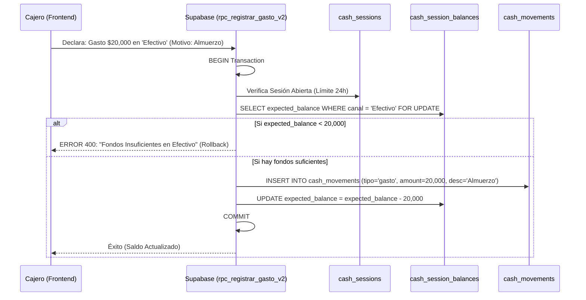

# SDD-026: Política de Gastos Generales (OPEX Inmediato)

> **Asociado a:** [FRD-026](../FRD/FRD_026_POLITICA_GASTOS_INMEDIATOS.md)  
> **Fase del Plan:** Fase 3 (Deudas y Crédito)  
> **Estado:** 🟡 Validado Localmente (Post PEA-N v1.0)  
> **Última Actualización:** 2026-08-04

---

## 0. Contexto y Restricciones Aplicables (PEA-N)

### 0.1 Políticas Globales Activadas (ARQ-002)
| Política ID | Dominio | Impacto Concreto en este SDD |
|-------------|---------|------------------------------|
| **POL-FIN-01** | Financiero | Inmediatez Absoluta. Queda prohibido modelar gastos como promesas ("Cuentas por pagar de servicios públicos"). Si no salió la plata de la caja hoy, el gasto no existe en el sistema. |
| **POL-AUD-01** | Auditoría | Trazabilidad del Egreso. Todo gasto debe inyectar forzosamente un concepto legible (motivo) en `cash_movements`. |

### 0.2 Restricciones Transversales Inyectadas (Fase 0)
| SDD Origen | Restricción Inyectada | Impacto en Gastos |
|------------|-----------------------|-------------------|
| **SDD_027 (Caja Multicanal)** | Prevención de Sobregiro por Canal. | Un gasto no puede extraerse de una "caja genérica". Debe exigir `payment_method_id` y abortar transaccionalmente si `expected_balance < p_amount`. |

### 0.3 Auditoría de BD contra Realidad (Deuda Técnica Crítica)
La auditoría revela que la mecánica de registro de gastos operativos diarios (OPEX) no posee gobierno en la base de datos.
| Hallazgo / Componente | Brecha Descubierta | Solución Obligatoria (DSD/SQL) |
|-----------------------|--------------------|--------------------------------|
| 🔴 RPC Inexistente | No existe un RPC dedicado a registrar gastos (`rpc_registrar_gasto`). Si el Frontend está insertando directamente en `cash_movements` vía RLS, está evadiendo la prevención de sobregiros (Fase 0). | Bloquear `INSERT` directo en `cash_movements` vía RLS. Crear `rpc_registrar_gasto_v2` con protección anti-sobregiro. |
| 🔴 Falta validación 24H | Si el registro de gastos se hace directo a tabla, nadie está validando que el turno esté dentro del límite seguro de 24 horas (`SDD_027_02`). | Inyectar `now() - opened_at > 24h` en el nuevo RPC de gastos. |

---

## 1. Responsabilidad Lógica: El Desembolso Puro

A diferencia de proveedores o clientes, los "Gastos Generales" (Luz, Agua, Transportes, Alimentación) no generan deudas en la base de datos. Si llega el recibo de la luz el lunes y se paga el viernes, el sistema **solo** recibe el dato el viernes.

El módulo actúa exclusivamente como una válvula de escape de liquidez.

---

## 2. Modelado de Flujos

### 2.1 Flujo de Registro de Gasto OPEX

El flujo previene la corrupción del saldo reportado, abortando si el cajero intenta registrar un pago mayor a lo que realmente hay en la gaveta o cuenta bancaria.

---

## 3. Contrato de Datos (Interfaz RPC)

### 3.1. Firma: `rpc_registrar_gasto_v2` (Desarrollo Obligatorio)

| Parámetro | Tipo | Obligatorio | Descripción |
|-----------|------|-------------|-------------|
| `p_store_id` | UUID | Sí | Tienda. Validado contra Auth. |
| `p_amount` | Decimal | Sí | Monto extraído. |
| `p_payment_method_id` | UUID | Sí | ID del canal (Efectivo, Tarjeta, Transferencia) del cual sale el dinero. |
| `p_description` | String | Sí | Motivo explícito y no nulo. |

---

## 4. Análisis de Seguridad

- **Blindaje RLS:** Al migrar la lógica al RPC `rpc_registrar_gasto_v2`, la tabla `cash_movements` perderá los permisos de `INSERT` directo desde el cliente Vue. Esto fuerza a que todo egreso pase por el embudo de validación de 24 horas y prevención de sobregiros.
- **Inmutabilidad:** Los gastos, una vez insertados, no pueden ser borrados (`DELETE`) ni actualizados (`UPDATE`). Si el cajero se equivoca, la política de auditoría dicta que el administrador debe insertar un contra-movimiento manual (`tipo = ingreso`, `motivo = 'Corrección de gasto erróneo'`).
