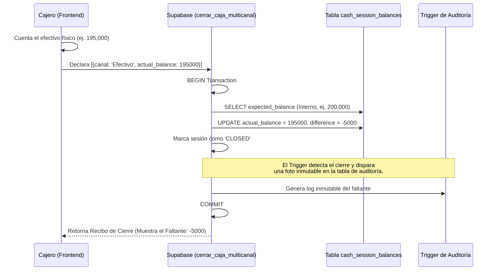
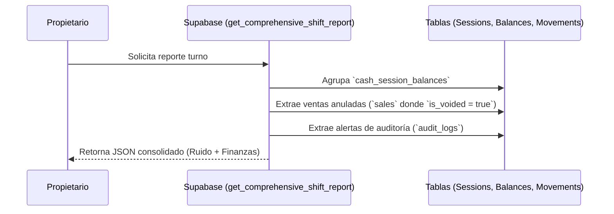

# SDD-027-01: Reportes y Auditoría de Caja Diaria

> **Asociado a:** [FRD-027-01](../FRD/FRD_027_01_REPORTES_DE_CAJA.md)  
> **Fase del Plan:** Fase 2 (Caja y Liquidez)  
> **Estado:** 🟢 Aprobado y Validado (Post PAC-N)
> **Última Actualización:** 2026-08-05

---

## 0. Contexto y Restricciones Aplicables (PEA-N)

### 0.1 Políticas Globales Activadas (ARQ-002)
| Política ID | Dominio | Impacto Concreto en este SDD |
|-------------|---------|------------------------------|
| **POL-FIN-01** | Financiero | Fidelidad al flujo puro. Prohibido reportar fiados no cobrados o cuentas por pagar no pagadas como liquidez. |
| **POL-AUD-02** | Auditoría | Dicotomía del Reporte. El cajero solo ve su resumen operativo (ciego a expectativas); el dueño ve el forense (descuadres, mermas). |
| **POL-AUD-03** | Auditoría | Autenticidad de Descuadres. Cualquier diferencia (`expected` vs `actual`) queda sellada criptográficamente (Trigger). |
| **POL-SEG-01** | Seguridad | Arqueo Ciego. El backend tiene PROHIBIDO exponer el `expected_balance` al frontend mientras la caja esté en estado `OPEN`. |

### 0.2 Restricciones Transversales Inyectadas (Fase 0)
| SDD Origen | Restricción Inyectada | Impacto en los Reportes de Caja |
|------------|-----------------------|---------------------------------|
| **SDD_027 (Caja Multicanal)** | El pozo único ya no existe. | El reporte no puede devolver un `total_general` mágico. Debe devolver un arreglo detallando `opening`, `expected`, `actual` y `difference` **por cada canal** (`payment_method_id`). |
| **SDD_010_016 (FIFO)** | El Costo de Venta (COGS) es aislado. | El reporte de caja **TIENE PROHIBIDO** calcular márgenes o ganancias. Su única responsabilidad es contar liquidez (dinero que entró y salió). |

### 0.3 Auditoría de BD contra Realidad (Deuda Técnica Crítica)
La auditoría PEA-N revela que los RPCs actuales están acoplados al modelo obsoleto de caja monolítica y violan los contratos de Fase 0.
| Hallazgo / Función | Brecha Descubierta | Solución Obligatoria |
|--------------------|--------------------|----------------------|
| 🔴 `get_history_caja` | Lee `opening_balance` directamente de `cash_sessions` (columna a depreciar). Mezcla ingresos/gastos globales. | Reescribir el RPC para agrupar los datos desde la nueva tabla `cash_session_balances` por `payment_method_id`. |
| 🔴 `trg_audit_cash_closed` | El trigger lee `NEW.opening_balance` y `NEW.difference` de la tabla padre. | El trigger de auditoría debe modificarse para observar los cierres en `cash_session_balances`. |
| 🔴 Arqueo Ciego Vulnerable | El RPC `cerrar_caja` calcula la diferencia internamente, pero el cliente (Cajero) podría calcular el saldo si hace queries directas a `cash_movements`. | RLS en `cash_movements` debe impedir que el Cajero sume sus propios totales; o bien, forzar que solo vea el historial sin totales globales de expectativa. |

---

## 1. Dicotomía del Reporte (Arquitectura de Vistas)

El sistema expone dos "lentes" para ver la misma sesión, garantizando seguridad y claridad.

### 1.1 Lente Operativo (El Cajero)
- **Objetivo:** Declarar el dinero físico al final del turno.
- **Restricción:** El cajero puede ver el desglose de lo que vendió, pero **NO** puede ver el cálculo de cuánto dinero debería tener la gaveta (`expected_balance`).
- **Comportamiento:** Si falta dinero, el cajero entrega su físico y se entera del faltante *después* de que el turno ya fue sellado irremediablemente por el backend.

### 1.2 Lente Forense (El Administrador/Dueño)
- **Objetivo:** Auditoría profunda.
- **Visibilidad Total:** Ve el `expected_balance`, el `actual_balance`, y la diferencia exacta.
- **Ruido Operativo:** El reporte forense incluye intentos de anulación (`is_voided = true`), mermas declaradas en el turno y alertas de sobregiro rechazadas, dibujando el comportamiento del empleado.

---

## 2. Modelado de Flujos

### 2.1 Flujo de Arqueo Ciego y Sellado (Inmutabilidad)

Este flujo demuestra cómo el sistema obliga al cajero a ser honesto sin conocer la meta.

### 2.2 Flujo de Inspección Forense

---

## 3. Contrato de Datos (Interfaz RPC)

Dado que `get_history_caja` está obsoleto, se define la estructura lógica del nuevo RPC que el Frontend consumirá.

### 3.1. Entidad: Reporte de Sesión (Lectura)
Retornado por `rpc_get_comprehensive_shift_report`.

| Propiedad Lógica | Tipo | Descripción (Multicanal) |
|------------------|------|--------------------------|
| `session_id` | UUID | Identificador del turno. |
| `status` | ENUM | `OPEN`, `CLOSED`. |
| `balances` | Array | Arreglo conteniendo el resumen por cada canal. |
| `balances[n].method` | String | Nombre del canal (Efectivo, Transferencia). |
| `balances[n].expected`| Number | Lo calculado matemáticamente por el servidor. |
| `balances[n].actual` | Number | Lo declarado físicamente por el cajero (Nulo si está OPEN). |
| `balances[n].difference` | Number | `actual - expected`. Si es < 0, es un faltante. |
| `anomalies` | Array | Lista de tickets anulados o alertas generadas en este turno. |

---

## 4. Análisis de Seguridad

- **Prevención de Manipulación (Spoofing de Cierre):** El payload de `cerrar_caja` recibe el `actual_balance`. Si un cajero malicioso intercepta la petición e intenta inyectar el `expected_balance` como parámetro para auto-aprobarse, el backend ignorará el input del `expected` y forzará el cálculo a nivel de motor SQL sumando `cash_movements`.
- **Bloqueo Post-Cierre:** Ningún rol, incluyendo `postgres` o `admin`, puede modificar un registro en `cash_session_balances` si la sesión padre está en `CLOSED`. Esto debe garantizarse vía Row Level Security (RLS) estricta, utilizando obligatoriamente las funciones `assert_store_access` y `get_current_store_id` para garantizar el aislamiento multitenant absoluto.
