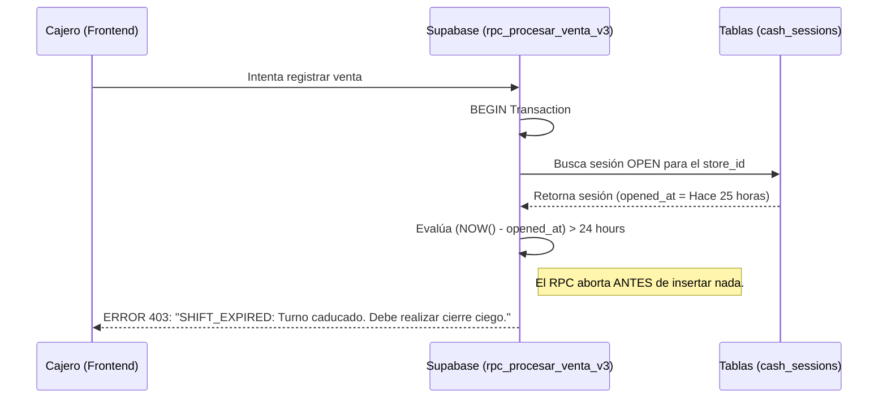
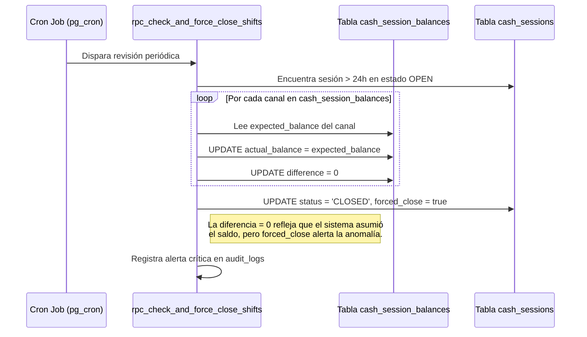

# SDD-027-02: Límite de 24 Horas y Caducidad de Caja

> **Asociado a:** [FRD-027-02](../FRD/FRD_027_02_LIMITE_24_HORAS_CAJA.md)  
> **Fase del Plan:** Fase 2 (Caja y Liquidez)  
> **Estado:** 🟡 Validado Localmente (Post PEA-N v1.0)  
> **Última Actualización:** 2026-08-04

---

## 0. Contexto y Restricciones Aplicables (PEA-N)

### 0.1 Políticas Globales Activadas (ARQ-002)
| Política ID | Dominio | Impacto Concreto en este SDD |
|-------------|---------|------------------------------|
| **POL-SEG-02** | Seguridad | Caducidad del turno. El sistema no puede permitir que la contabilidad de dos días se mezcle por negligencia del cajero. |
| **POL-AUD-01** | Auditoría | Inmutabilidad Histórica. Todo cierre forzado debe documentar quién lo forzó (Admin) y por qué (24h reached). |

### 0.2 Restricciones Transversales Inyectadas (Fase 0)
| SDD Origen | Restricción Inyectada | Impacto en la Caducidad |
|------------|-----------------------|-------------------------|
| **SDD_027 (Caja Multicanal)** | El cierre afecta a múltiples canales independientemente. | El cierre forzado **debe cuadrar a cero** (asumiendo `actual = expected`) iterando sobre cada canal en `cash_session_balances`, no globalmente. |

### 0.3 Auditoría de BD contra Realidad (Deuda Técnica Crítica)
La auditoría revela que la base de datos actual posee una protección muy débil y mal implementada contra la regla de las 24 horas.
| Hallazgo / Función | Brecha Descubierta | Solución Obligatoria (DSD/SQL) |
|--------------------|--------------------|--------------------------------|
| 🔴 `rpc_procesar_venta_v2` | Selecciona la sesión activa (`status='open'`) sin validar si `opened_at` excedió las 24 horas. Permite inyectar ventas a un turno caducado. | Modificar la validación en todo RPC financiero para abortar (`RAISE EXCEPTION 'SHIFT_EXPIRED'`) si `now() - opened_at > 24h`. |
| 🔴 `rpc_check_and_force_close_shifts` | Calcula saldos globales (violando Fase 0 multicanal) y asigna `actual_balance = NULL` y `difference = NULL`. | Reescribir el cron job para que, por cada `payment_method_id` en `cash_session_balances`, asigne `actual = expected` y `difference = 0`. |

---

## 1. Responsabilidad Lógica de la Caducidad

La caducidad de 24 horas es el mecanismo defensivo principal para garantizar la "Pureza del Flujo Diario". El sistema asume que ningún operario humano trabaja 24 horas seguidas. Si un turno alcanza este umbral, se asume **Abandono de Puesto** o **Negligencia de Cierre**.

Esta protección consta de dos barreras concéntricas:
1. **Barrera Transaccional (Inmediata):** El RPC de ventas rechaza activamente nuevas inyecciones si el turno ya caducó, incluso si el cron job aún no ha corrido.
2. **Barrera Administrativa (Asíncrona):** Un Cron Job (o acción manual del administrador) clausura el turno abandonado para desbloquear la tienda, asumiendo un riesgo financiero justificado.

---

## 2. Modelado de Flujos

### 2.1 Flujo de Barrera Transaccional (Rechazo Inmediato)

Este flujo previene que un cajero que olvidó cerrar ayer, intente vender hoy usando la misma caja.

### 2.2 Flujo de Cierre Forzoso Multicanal

Cuando el cajero no está disponible, el Administrador o Cron Job fuerza el cierre, pero ahora respetando la arquitectura de canales (Fase 0).

---

## 3. Contrato de Interfaz Frontend (UI)

El Frontend debe ser proactivo para evitar que el cajero pierda tiempo intentando vender cuando la caja ya está caducada.

### 3.1. Estado de la Aplicación (Pinia/Vue)
- **Suscripción en Tiempo Real:** El cliente Vue debe calcular localmente el tiempo transcurrido desde `opened_at`. Si el temporizador cruza las 24 horas:
  - El botón de "Cobrar" (POS) se deshabilita automáticamente.
  - Los formularios de Gastos e Ingresos se bloquean.
  - Se despliega un Banner Rojo persistente: *"Su turno ha excedido las 24 horas. Proceda a realizar el Arqueo Ciego inmediatamente para desbloquear las operaciones."*
- **Sincronización Offline:** Si el sistema estaba offline y las ventas se encolaron, al volver online, si el servidor rechaza el bulk insert con el código `SHIFT_EXPIRED`, el Frontend DEBE forzar la pantalla de cierre de caja, enviar el cierre, y luego reintentar el volcado de ventas (o encolarlas para el nuevo turno si las reglas del negocio lo permiten).

---

## 4. Análisis de Seguridad

- **Justificación de `difference = 0` en Cierres Forzosos:** Matemáticamente, al no haber conteo humano, no se puede calcular faltante ni sobrante físico. El sistema asume temporalmente cuadre perfecto (`difference = 0`). Sin embargo, para evitar fraudes, el flag booleano `forced_close = true` anula la validez legal del cuadre. Si posteriormente el conteo físico del dinero es menor, la pérdida es asumida administrativamente por la negligencia de abandono.
- **Inmutabilidad del Cierre Forzoso:** Al igual que un cierre normal, un turno cerrado forzosamente no puede ser reabierto. El flujo operativo debe continuar abriendo un nuevo turno.
