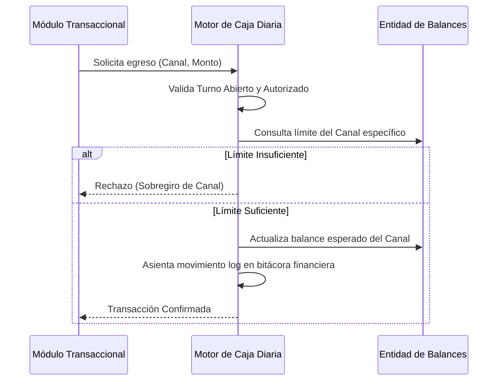
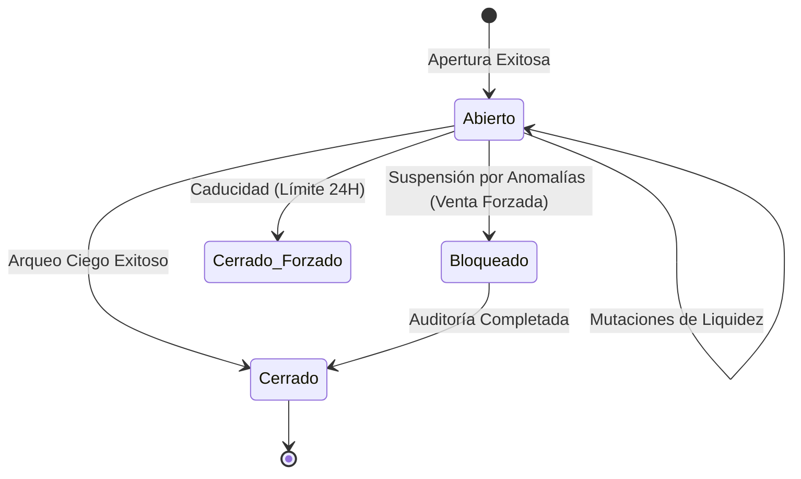

# SDD-027: Núcleo de Caja Diaria (Flujo de Caja Puro)

> **Asociado a:** [FRD-027](../FRD/FRD_027_NUCLEO_CAJA_DIARIA.md)  
> **Fase del Plan:** Fase 0 (Contratos Transversales)  
> **Estado:** 🟢 Auditado y Corregido (QA Manual)  
> **Última Actualización:** 2026-08-05

---

## § 0. Contexto y Restricciones Aplicables (PEA-N)

### 0.1 Políticas Globales Activadas
| Política | Impacto Específico en este SDD |
|----------|-------------------------------|
| **Límite de Liquidez Real (POL-FIN-01)** | Prohibido consolidar transacciones diferidas o créditos (fiados) dentro del balance de liquidez disponible. |
| **Segregación Estricta de Canales (POL-FIN-02)** | El sistema no maneja una "caja única". Debe estructurarse un balance independiente para cada método de pago. |
| **Arqueo Ciego (POL-SEG-01)** | El sistema tiene prohibido revelar el saldo esperado al operario durante la declaración de cierre. |

---

## § 1. Glosario Local

* **Turno Contable:** Periodo inmutable donde un actor es responsable de los movimientos líquidos.
* **Canal Financiero:** Medio por el cual circula la liquidez (Efectivo, Tarjeta, Billetera Digital). Los balances nunca se mezclan.
* **Arqueo Ciego:** Proceso donde el actor declara lo que cuenta físicamente sin conocer las proyecciones del servidor.

---

## § 2. Diagrama de Secuencia

### Caso de Uso: Mutación de Liquidez Multicanal

---

## § 3. Diagrama de Estados

### Ciclo de Vida del Turno

---

## § 4. Especificación Detallada de Casos de Uso

### Caso A: Apertura de Turno Multicanal
- **Precondiciones:** El operario no tiene otro turno activo.
- **Flujo Principal:**
  1. El operario transmite la intención de iniciar operaciones.
  2. El servidor valida la ausencia de superposiciones.
  3. El servidor crea la entidad agrupadora del turno.
  4. El servidor siembra balances iniciales (en cero) para cada canal financiero habilitado.
- **Postcondiciones:** Turno habilitado para recepción de operaciones de liquidez.

### Caso B: Inyección / Extracción de Liquidez
- **Precondiciones:** Turno abierto y vigente.
- **Flujo Principal:**
  1. El controlador externo (POS, Gastos) solicita asentar un valor monetario.
  2. El servidor valida que la instrucción contenga un identificador de canal explícito.
  3. Si la operación es un egreso, el servidor verifica matemáticamente que el canal posea fondos suficientes.
  4. El servidor suma o resta el monto al acumulado del canal específico.
  5. El servidor asienta el movimiento en la bitácora financiera inmutable.
- **Postcondiciones:** Balance del canal actualizado.

### Caso C: Declaración de Cierre (Arqueo Ciego)
- **Precondiciones:** Turno abierto y operario autenticado.
- **Flujo Principal:**
  1. El operario envía una colección de montos contados físicamente, separados por canal.
  2. El servidor sella el turno cambiando su estado a cerrado, congelando nuevas transacciones.
  3. El servidor compara los valores declarados contra las proyecciones teóricas.
  4. El servidor registra la diferencia exacta (cuadre o descuadre) por canal.
  5. El servidor devuelve el reporte comparativo al cliente.
- **Postcondiciones:** Turno finalizado irreversiblemente.

---

## § 5. Contrato de Interfaz

### Operación: Extracción Estricta
- **Entrada esperada:** 
  - Identificador de la tienda (tenant).
  - Valor monetario a sustraer.
  - Identificador del canal financiero afectado.
- **Reglas de transformación / cálculo:**
  - El motor DEBE rechazar la solicitud arrojando una excepción lógica si el saldo acumulado en el canal dictaminado es inferior a la sustracción.
  - El motor PROHÍBE que una extracción de dinero afecte saldos globales; cada centavo pertenece a su canal.
- **Salida esperada:** Confirmación de mutación, o rechazo estructural.

---

## § 6. Análisis de Seguridad

- **Control de Acceso:** La apertura y cierre de caja asumen la validación estricta del perímetro territorial del usuario.
- **Protección de Datos:** Las proyecciones de balance (`expected_balance`) jamás se transmiten a la capa cliente durante operaciones rutinarias ni cierres, evadiendo la filtración de información para evitar "cuadres fabricados" por el cajero.
- **Superficie de Amenazas:** 
  - *Amenaza:* Secuestro de turno.
  - *Mitigación:* El servidor descubre automáticamente la sesión abierta a nombre del usuario autenticado; el cliente jamás transmite el ID del turno en el paquete de peticiones para evitar suplantaciones lógicas.

---

## § 7. Modelo de Datos Lógico

- **Entidad Agrupadora (Turno):** Aloja los metadatos de apertura, estado, autor y sellado temporal.
- **Entidad de Desglose (Saldos de Canal):** Sub-entidad del Turno. Mapea un canal financiero específico a tres valores inmutables: saldo inicial sembrado, proyección esperada y declaración física final.
- **Bitácora Financiera:** Colección apendicular donde todo movimiento (ingreso o egreso) debe referenciar atómicamente el canal afectado y la justificación causal.
