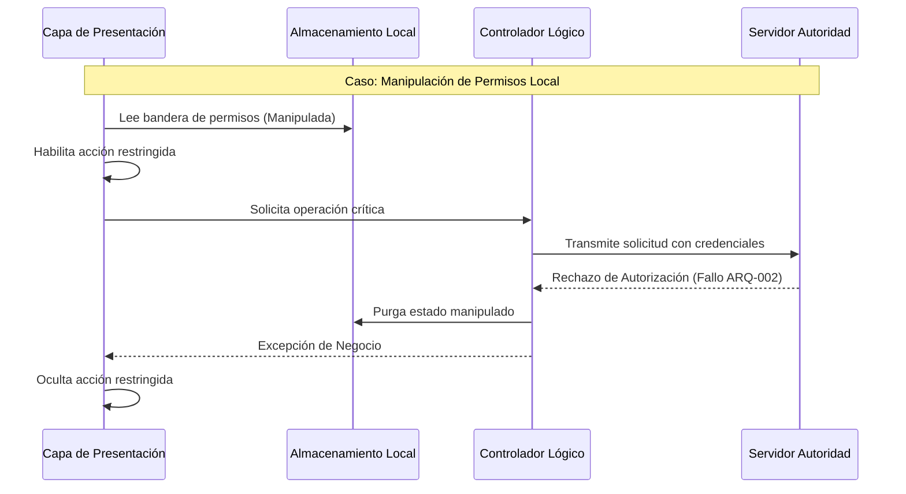

# SDD-028: Almacenamiento Local Seguro y Caché de Aplicación

## § Cabecera

- **FRDs de origen:** [FRD-028](../FRD/FRD_028_ALMACENAMIENTO_LOCAL_SEGURO.md)
- **Fase del Plan:** Fase 7 (Resiliencia y Sincronización)
- **Estado:** 🟢 Validado
- **Políticas Aplicables:** 
  - **ARQ-002:** Autoridad del servidor sobre cualquier caché del cliente.

## § Glosario Local

- **Almacenamiento Síncrono:** Persistencia de memoria con cuota ultra reducida, bloqueante.
- **Almacenamiento Asíncrono:** Base de datos embebida en el cliente, tolerante a grandes volúmenes.
- **Estado Optimista:** Patrón de interfaz donde el cliente asume éxito inmediato basado en la validación local, sujeto a corrección si el servidor rechaza la petición.

## § Diagrama de Secuencia

## § Especificación Detallada de Casos de Uso

### Caso 1: Cierre de Sesión Seguro
- **Precondiciones:** El usuario decide finalizar su sesión, existiendo operaciones diferidas pendientes.
- **Reglas de Negocio Aplicables:** Supervivencia de colas operativas (RN-CACHE-03).
- **Flujo Principal:**
  1. El usuario invoca el cierre de sesión.
  2. El sistema purga destructivamente las credenciales de acceso del almacenamiento síncrono.
  3. El sistema purga los catálogos de dominio (clientes, inventario) del almacenamiento asíncrono para proteger el aislamiento de tenant.
  4. El sistema **PRESERVA** intactas las colas de transacciones diferidas y registros de auditoría locales.
- **Postcondiciones:** La sesión finaliza sin comprometer la inmutabilidad de transacciones pendientes.

### Caso 2: Intercepción de Caché Corrupto
- **Precondiciones:** La estructura de los datos locales es inválida debido a alteraciones o actualizaciones del sistema.
- **Flujo Principal:**
  1. El controlador lógico intenta decodificar un fragmento del caché.
  2. Se produce una falla de lectura.
  3. El sistema intercepta el fallo silenciando el error visual.
  4. El sistema purga atómicamente el fragmento corrupto.
  5. El sistema fuerza una descarga limpia desde el servidor.
- **Postcondiciones:** El sistema se auto-repara sin interrumpir al usuario.

## § Contrato de Interfaz

### Operación: Estratificación de Almacenamiento
- **Entrada esperada:** Petición de persistencia de un dato local.
- **Reglas de transformación / cálculo:**
  - **Nivel 1 (Memoria Volátil):** Destinado exclusivamente a filtros de búsqueda y estados efímeros. Se destruye al cerrar la interfaz.
  - **Nivel 2 (Almacenamiento Síncrono):** Estrictamente reservado para credenciales y banderas escalares de interfaz (ej. tema visual). PROHIBIDO almacenar colecciones.
  - **Nivel 3 (Almacenamiento Asíncrono):** Obligatorio para la persistencia del catálogo, clientes y las colas de operaciones diferidas.

## § Análisis de Seguridad

- **Control de Acceso:** Cualquier bandera almacenada localmente que otorgue privilegios administrativos es puramente cosmética. Toda transacción crítica será sometida a la validación centralizada del servidor.
- **Protección de Datos:** Para prevenir la filtración de datos cruzados entre distintos usuarios operando el mismo dispositivo, es mandatorio que el cierre de sesión destruya todos los catálogoscacheados.
- **Superficie de Amenazas:** 
  - *Amenaza:* Destrucción de la cola de transacciones diferidas mediante comandos de purga total al cerrar sesión.
  - *Mitigación:* Se prohíbe el uso de comandos de limpieza global destructiva; la purga debe ser ejecutada por una rutina selectiva que respete la preservación de colas operativas.
- **Trazabilidad de Auditoría:** Las manipulaciones descubiertas por el servidor desencadenan rechazos que pueden ser registrados a nivel de monitorización.

## § Modelo de Datos Lógico

*(No aplica a nivel de Base de Datos. Establece las reglas lógicas para el adaptador de persistencia en la arquitectura del cliente).*
