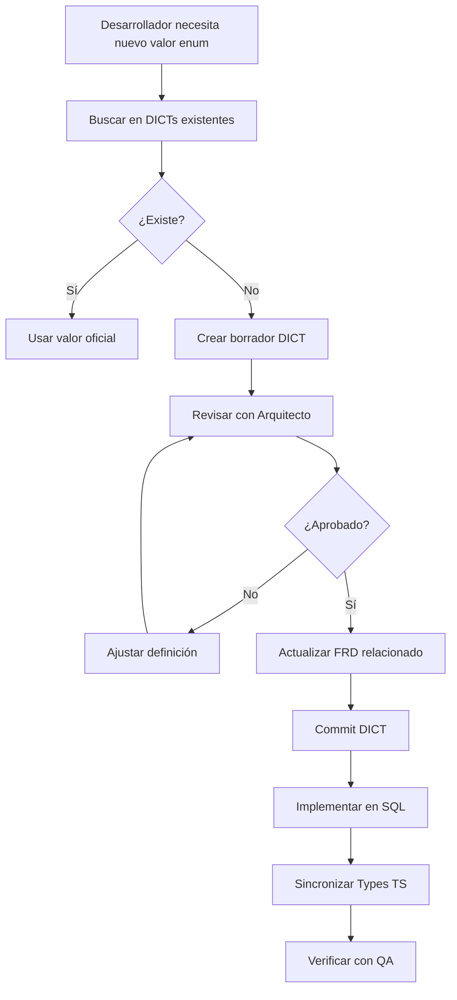

# 📐 Estándar ARQ-001: Gobernanza de Terminología

**Versión:** 1.0  
**Fecha:** 2026-02-05  
**Autor:** Arquitecto de Producto  
**Estado:** ✅ Activo

---

## Problema que Resuelve

Evitar inconsistencias terminológicas entre Frontend, Backend y Documentación que generan:
- ❌ Bugs de constraint violation
- ❌ Descoordinación entre migraciones
- ❌ Ambigüedad en requisitos
- ❌ Código no mantenible

---

## Principio Fundamental

> **"Un término, una definición, una implementación"**

Todo valor enum, constante o dominio de datos DEBE tener:
1. **Definición semántica clara** en DICT
2. **Aprobación arquitectónica** antes de implementar
3. **Implementación consistente** en SQL + TypeScript

---

## Sistema de Diccionarios (DICT)

### Ubicación
```
documentation/01_requirements/DICT/
├── README.md (Explicación del sistema)
├── DICT_001_CASH_MOVEMENTS.md
├── DICT_002_INVENTORY_MOVEMENTS.md
└── DICT_XXX_[NOMBRE].md
```

### Formato de Numeración
- `DICT-001`, `DICT-002`, etc.
- Numeración secuencial
- No reutilizar números eliminados

---

## Proceso de Aprobación

### Flujo de Trabajo



### Checklist de Validación

Antes de aprobar un nuevo DICT/valor:

**Semántica:**
- [ ] Tiene definición clara y no ambigua
- [ ] No se solapa con valores existentes
- [ ] Cubre todos los casos de uso identificados

**Documentación:**
- [ ] FRD relacionado actualizado
- [ ] Ejemplos de uso incluidos
- [ ] Referencias cruzadas completas

**Implementación:**
- [ ] Constraint SQL creado/actualizado
- [ ] Types TypeScript sincronizados
- [ ] Tests cubren todos los valores

---

## Responsabilidades por Rol

| Rol | Responsabilidad |
|-----|-----------------|
| **Arquitecto** | Crear/Aprobar DICTs, mantener consistencia, resolver conflictos |
| **Data** | Implementar constraints SQL exactos según DICT |
| **UX** | Usar valores definidos en UI, NUNCA inventar nuevos |
| **QA** | Validar que implementación cumple DICT |
| **Orquestador** | Verificar sincronización Backend ↔ Frontend |

---

## Reglas de Oro

### 1. No Inventar Valores
**Prohibido:**
```typescript
// ❌ Inventar valores no documentados
movement_type: 'entrada'  // No existe en DICT-001
```

**Correcto:**
```typescript
// ✅ Usar valor oficial de DICT-001
movement_type: 'ingreso'
```

### 2. No Asumir Sinonimia
Solo porque "entrada" y "ingreso" son sinónimos en español **NO significa que sean intercambiables en código**.

**El DICT define cuál es el valor técnico oficial.**

### 3. No Modificar Sin Migración
Si un DICT cambia, DEBE haber:
1. Nueva versión del DICT
2. Migración SQL de datos existentes
3. Actualización de Types TS
4. Comunicación al equipo

---

## Casos de Uso

### Caso 1: Agregar Nuevo Valor a DICT Existente

**Escenario:** Necesito agregar `'transferencia'` a `cash_movements.movement_type`

**Pasos:**
1. Abrir `DICT_001_CASH_MOVEMENTS.md`
2. Agregar fila en tabla "Valores Permitidos":
   ```markdown
   | `'transferencia'` | Transferencia Bancaria | Movimiento entre cuentas | Cuadre de caja |
   ```
3. Actualizar constraint SQL en sección "Implementación"
4. Crear migración:
   ```sql
   ALTER TABLE cash_movements DROP CONSTRAINT cash_movements_movement_type_check;
   ALTER TABLE cash_movements ADD CONSTRAINT cash_movements_movement_type_check 
   CHECK (movement_type IN ('ingreso', 'gasto', 'transferencia'));
   ```
5. Actualizar Types TS:
   ```typescript
   export type CashMovementType = 'ingreso' | 'gasto' | 'transferencia';
   ```
6. Incrementar versión del DICT: `1.0` → `1.1`

---

### Caso 2: Crear Nuevo DICT

**Escenario:** Necesito definir valores para `payment_method`

**Pasos:**
1. Crear `DICT_003_PAYMENT_METHODS.md` siguiendo plantilla
2. Definir todos los valores: `'efectivo'`, `'nequi'`, `'fiado'`
3. Documentar semántica de cada uno
4. Revisar con Arquitecto
5. Actualizar FRD relacionado (ej: FRD-007 Ventas)
6. Implementar constraint SQL
7. Sincronizar Types TS

---

### Caso 3: Resolver Conflicto Histórico

**Escenario:** Encontré que `financial_core.sql` usa `'salida'` pero constraint solo permite `'ingreso'` o `'gasto'`

**Pasos:**
1. Crear INVESTIGATION report documentando inconsistencia
2. Buscar en FRD cuál es el término oficial
3. Si DICT no existe, crearlo basado en FRD
4. Si existe, verificar cuál valor rompe el DICT
5. Crear migración correctiva
6. Aplicar con autorización de Arquitecto
7. Documentar en "Historial de Cambios" del DICT

**Ejemplo Real:** `INVESTIGATION_CASH_MOVEMENTS_TERMINOLOGY.md` → `DICT_001_CASH_MOVEMENTS.md`

---

## Plantilla de DICT

```markdown
# DICT-XXX: [Nombre del Dominio]

**Versión:** 1.0  
**Fecha:** YYYY-MM-DD  
**Autor:** [Nombre]  
**FRD Relacionado:** [Link al FRD]

---

## Dominio

[Descripción breve del área funcional]

---

## Valores Permitidos

### `nombre_campo`

| Valor Técnico | Término de Negocio | Semántica | Ejemplos de Uso |
|---------------|-------------------|-----------|-----------------|
| `'valor1'` | Nombre descriptivo | ¿Qué significa? | Casos de uso |

---

## Reglas de Negocio

1. [Regla específica]

---

## Valores NO Permitidos

| Valor Incorrecto | Razón |
|------------------|-------|
| `'valor_malo'` | Por qué no se debe usar |

---

## Implementación Técnica

### Constraint SQL

```sql
ALTER TABLE public.tabla 
ADD CONSTRAINT tabla_campo_check 
CHECK (campo IN ('valor1', 'valor2'));
```

### TypeScript Types

```typescript
export type TipoCampo = 'valor1' | 'valor2';
```

---

## Casos de Uso Documentados

### Caso 1: [Nombre]
**Actor:** [Quién]  
**Acción:** [Qué hace]  
**Resultado Backend:** [SQL generado]

---

## Historial de Cambios

| Versión | Fecha | Autor | Cambio |
|---------|-------|-------|--------|
| 1.0 | YYYY-MM-DD | Nombre | Creación inicial |

---

## Referencias

- [Link a documentación relacionada]
```

---

## Métricas de Éxito

**Indicadores de que el sistema funciona:**
- ✅ 0 bugs por valores enum incorrectos en producción
- ✅ 100% de columnas enum tienen DICT correspondiente
- ✅ Tiempo de resolución de ambigüedades < 1 día
- ✅ 0 valores "inventados" en código sin documentar

---

## Revisión y Evolución

**Frecuencia:** Trimestral  
**Responsable:** Arquitecto de Producto

**Preguntas de Revisión:**
1. ¿Hay DICTs obsoletos que se puedan consolidar?
2. ¿Hay columnas enum sin DICT?
3. ¿El proceso está siendo seguido por el equipo?
4. ¿Se requieren ajustes al formato/plantilla?

---

## Anexos

### Anexo A: Comparación con Constraints

| Aspecto | DICT | Constraint SQL |
|---------|------|----------------|
| **Propósito** | Documentar semántica | Validar datos |
| **Ubicación** | Git (versionado) | Base de datos |
| **Audiencia** | Todo el equipo | Solo Backend |
| **Modifica** | Arquitecto | Data (con aprobación) |

**Conclusión:** DICT y Constraint son complementarios, no redundantes.

### Anexo B: Caso Real de Éxito

**Bug Original:**
- Migración `20260205160000` usó `'entrada'` (no definido)
- Sistema falló con constraint violation

**Resolución con DICT:**
1. Investigación determinó valores oficiales: `'ingreso'`, `'gasto'`
2. Creado DICT-001 formalizando terminología
3. Hotfix aplicado: `'entrada'` → `'ingreso'`
4. Bug adicional detectado y corregido: `'salida'` → `'gasto'`

**Resultado:**
- ✅ Sistema funcional
- ✅ Terminología oficial documentada
- ✅ Proceso establecido para prevenir repetición

---

**Firmado:** Arquitecto de Producto  
**Fecha:** 2026-02-05
