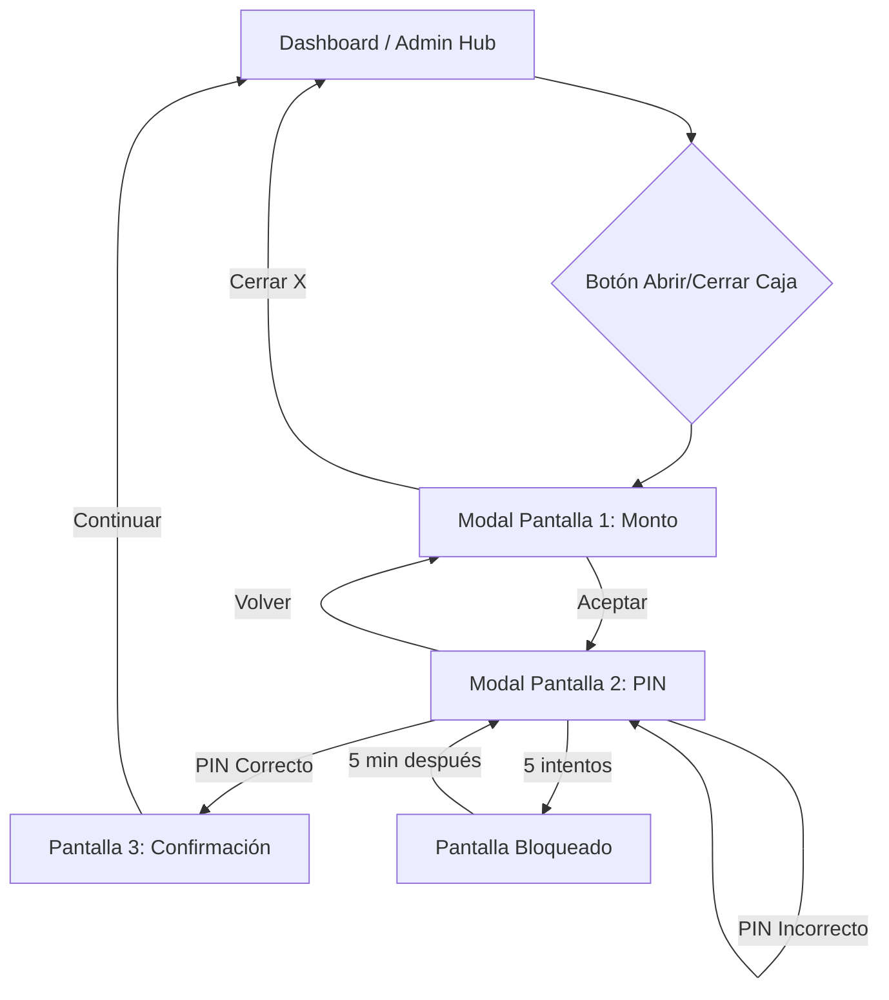

# 📋 Revisión SPEC-006: Control de Caja con PIN

**Documento bajo revisión:** [pin-cash-control.md](file:///c:/Users/Windows%2011/OneDrive/Desktop/prueba/01_REQUIREMENTS/pin-cash-control.md)  
**Fecha:** 2026-01-16  
**Revisado por:** Roles UX/UI + Arquitecto de Datos

---

## 🎨 ANÁLISIS UX/UI (Diseñador de Experiencia)

### ✅ Aspectos Positivos

| Aspecto | Evaluación |
|---------|------------|
| **Flujo de 2 pantallas** | Excelente decisión. Separa preocupaciones: primero monto, luego autorización. Reduce carga cognitiva. |
| **Sin botón de confirmación de PIN** | Buena UX. La validación automática al completar 6 dígitos acelera el flujo. |
| **Botón "Volver"** | Permite corregir errores sin perder el monto ingresado. |
| **Mensaje de confirmación visible** | El feedback de éxito con resumen (monto, quién, hora) refuerza la confianza del usuario. |
| **Onboarding contextual** | Configurar PIN cuando se necesita (no en registro) es correcto pedagógicamente. |

### ⚠️ Observaciones UX

| ID | Observación | Recomendación |
|----|-------------|---------------|
| **UX-01** | El flujo de cierre muestra "Efectivo esperado" antes de pedir el monto contado. Esto podría **anclar** al usuario a digitar el número esperado en lugar del real. | Considerar mostrar el "Efectivo esperado" **solo en la Pantalla 2** (confirmación), después de que el usuario ya digitó el monto real. Esto evita sesgo de confirmación. |
| **UX-02** | No hay forma de **cancelar** la operación desde la Pantalla 2 (PIN). Solo hay "Volver". | El flujo actual es correcto (Volver regresa a editar monto). Si el usuario quiere cancelar completamente, debe "Volver" y luego cerrar el modal. Aceptable, pero podría añadirse un "✕" en el header para cerrar todo. |
| **UX-03** | El keypad de PIN y el keypad de monto son **diferentes elementos**. | Reutilizar el mismo componente `NumpadKeyboard.vue` con diferentes modos para consistencia visual. |
| **UX-04** | No se define qué pasa si el usuario pulsa "Aceptar" con **monto = $0**. | Agregar validación: Botón "Aceptar" deshabilitado si monto ≤ 0, o permitir $0 con advertencia ("¿Estás seguro de abrir con $0?"). |
| **UX-05** | Los **círculos de PIN** (○ ○ ○ ○ ○ ○) no tienen animación definida. | Usar animación `popIn` existente en Design System (ya usada en registro anterior). Al digitar cada dígito, el círculo se llena con micro-animación. |

### 🎯 Propuesta de Estados Visuales

```
Estados de PIN Display:
[○ ○ ○ ○ ○ ○] → Vacío (gris)
[● ○ ○ ○ ○ ○] → 1 dígito (verde con popIn)
[● ● ● ● ● ●] → Completo (todos verdes, inicia validación)
[✗ ✗ ✗ ✗ ✗ ✗] → Error (todos rojos, shake animation, luego reset)
[⏳ ⏳ ⏳ ⏳ ⏳ ⏳] → Validando (pulse animation)
```

### 🗺️ Mapa de Navegación Propuesto



---

## 🗄️ ANÁLISIS DE DATOS (Arquitecto Supabase)

### ✅ Compatibilidad con Esquema Actual

| Aspecto | Estado | Notas |
|---------|--------|-------|
| Tabla `cash_register` existe | ✅ | Estructura compatible |
| Nueva tabla `cash_control_events` | 🆕 | Se propone como tabla nueva de auditoría |
| Campo `pin_hash` en stores | 🆕 | Requiere migración |
| Campos rate limiting | 🆕 | `pin_failed_attempts`, `pin_locked_until` |

### ⚠️ Observaciones de Datos

| ID | Observación | Recomendación | Impacto |
|----|-------------|---------------|---------|
| **DB-01** | El documento propone añadir `pin_hash` a "store_accounts o admin_profiles", pero estas tablas **no existen** en el schema actual. | Crear columna `owner_pin_hash` en tabla `stores` directamente. Alternativa: crear tabla `store_owners` separada si se planea multi-admin. | Alto |
| **DB-02** | La tabla `cash_control_events` duplica parcialmente `cash_register`. | **Opción A:** Extender `cash_register` con columnas de auditoría. **Opción B:** Mantener separadas (cash_register = operativo, cash_control_events = auditoría). Recomiendo Opción B para separación de concerns. | Medio |
| **DB-03** | El RPC `login_empleado_unificado` ya verifica estado de caja (`cash_register`). El nuevo sistema debe ser consistente. | Asegurar que `cash_control_events` y `cash_register` estén sincronizados o definir cuál es la fuente de verdad. | Alto |
| **DB-04** | No se define RPC para validar PIN del Admin/Dueño. Solo existe `login_empleado` para empleados. | Crear función RPC `validar_pin_admin(p_store_id, p_pin)` que valide el PIN del dueño separado del login. | Alto |
| **DB-05** | El campo `authorized_by` referencia UUID pero puede ser Admin o Empleado. Si es Admin no está en tabla `employees`. | Cambiar `authorized_by` a `TEXT` con el nombre directamente, o crear lógica para resolver tipo. | Medio |

### 📐 Modelo de Datos Propuesto

```sql
-- =============================================
-- SPEC-006: Control de Caja con PIN
-- =============================================

-- Extensión de tabla stores para PIN del dueño
ALTER TABLE stores ADD COLUMN IF NOT EXISTS owner_pin_hash TEXT;
ALTER TABLE stores ADD COLUMN IF NOT EXISTS pin_failed_attempts INTEGER DEFAULT 0;
ALTER TABLE stores ADD COLUMN IF NOT EXISTS pin_locked_until TIMESTAMPTZ;

-- Tabla de eventos de control de caja (auditoría)
CREATE TABLE IF NOT EXISTS cash_control_events (
    id UUID PRIMARY KEY DEFAULT gen_random_uuid(),
    store_id UUID NOT NULL REFERENCES stores(id) ON DELETE CASCADE,
    event_type TEXT NOT NULL CHECK (event_type IN ('open', 'close')),
    
    -- Usuario que autorizó (puede ser admin o empleado)
    authorized_by_id UUID,
    authorized_by_type TEXT NOT NULL CHECK (authorized_by_type IN ('admin', 'employee')),
    authorized_by_name TEXT NOT NULL,
    
    -- Montos
    amount_declared DECIMAL(12,2) NOT NULL,
    amount_expected DECIMAL(12,2),
    difference DECIMAL(12,2),
    
    -- Metadatos de seguridad
    pin_verified BOOLEAN DEFAULT true,
    device_fingerprint TEXT,
    ip_address INET,
    
    created_at TIMESTAMPTZ DEFAULT NOW()
);

-- Índices para consultas frecuentes
CREATE INDEX IF NOT EXISTS idx_cash_events_store ON cash_control_events(store_id);
CREATE INDEX IF NOT EXISTS idx_cash_events_date ON cash_control_events(created_at);
CREATE INDEX IF NOT EXISTS idx_cash_events_type ON cash_control_events(store_id, event_type);

-- RPC: Validar PIN de Admin/Dueño
CREATE OR REPLACE FUNCTION validar_pin_admin(
    p_store_id UUID,
    p_pin TEXT
)
RETURNS JSON AS $$
DECLARE
    v_store stores%ROWTYPE;
BEGIN
    -- Verificar bloqueo
    SELECT * INTO v_store FROM stores WHERE id = p_store_id;
    
    IF NOT FOUND THEN
        RETURN json_build_object('success', false, 'error_code', 'STORE_NOT_FOUND');
    END IF;
    
    IF v_store.pin_locked_until IS NOT NULL AND v_store.pin_locked_until > NOW() THEN
        RETURN json_build_object(
            'success', false,
            'error_code', 'PIN_LOCKED',
            'locked_until', v_store.pin_locked_until
        );
    END IF;
    
    -- Validar PIN (debe estar hasheado con bcrypt)
    IF v_store.owner_pin_hash = crypt(p_pin, v_store.owner_pin_hash) THEN
        -- Reset intentos fallidos
        UPDATE stores SET pin_failed_attempts = 0, pin_locked_until = NULL WHERE id = p_store_id;
        RETURN json_build_object('success', true);
    ELSE
        -- Incrementar intentos fallidos
        UPDATE stores 
        SET pin_failed_attempts = pin_failed_attempts + 1,
            pin_locked_until = CASE 
                WHEN pin_failed_attempts >= 4 THEN NOW() + INTERVAL '5 minutes'
                ELSE NULL
            END
        WHERE id = p_store_id;
        
        RETURN json_build_object(
            'success', false,
            'error_code', 'INVALID_PIN',
            'attempts_remaining', 5 - (SELECT pin_failed_attempts FROM stores WHERE id = p_store_id)
        );
    END IF;
END;
$$ LANGUAGE plpgsql SECURITY DEFINER;

-- RPC: Establecer PIN de Admin (primera vez o cambio)
CREATE OR REPLACE FUNCTION establecer_pin_admin(
    p_store_id UUID,
    p_new_pin TEXT,
    p_current_pin TEXT DEFAULT NULL
)
RETURNS JSON AS $$
DECLARE
    v_store stores%ROWTYPE;
BEGIN
    SELECT * INTO v_store FROM stores WHERE id = p_store_id;
    
    -- Validar formato PIN
    IF LENGTH(p_new_pin) != 6 OR p_new_pin !~ '^\d{6}$' THEN
        RETURN json_build_object('success', false, 'error', 'PIN debe ser de 6 dígitos');
    END IF;
    
    -- Si ya tiene PIN, validar el actual
    IF v_store.owner_pin_hash IS NOT NULL THEN
        IF p_current_pin IS NULL OR v_store.owner_pin_hash != crypt(p_current_pin, v_store.owner_pin_hash) THEN
            RETURN json_build_object('success', false, 'error', 'PIN actual incorrecto');
        END IF;
    END IF;
    
    -- Establecer nuevo PIN
    UPDATE stores 
    SET owner_pin_hash = crypt(p_new_pin, gen_salt('bf')),
        pin_failed_attempts = 0,
        pin_locked_until = NULL
    WHERE id = p_store_id;
    
    RETURN json_build_object('success', true);
END;
$$ LANGUAGE plpgsql SECURITY DEFINER;

-- RPC: Registrar evento de control de caja
CREATE OR REPLACE FUNCTION registrar_evento_caja(
    p_store_id UUID,
    p_event_type TEXT,
    p_amount_declared DECIMAL,
    p_authorized_by_name TEXT,
    p_authorized_by_type TEXT,
    p_authorized_by_id UUID DEFAULT NULL,
    p_device_fingerprint TEXT DEFAULT NULL
)
RETURNS JSON AS $$
DECLARE
    v_event_id UUID;
    v_amount_expected DECIMAL;
    v_difference DECIMAL;
BEGIN
    -- Calcular monto esperado solo para cierre
    IF p_event_type = 'close' THEN
        SELECT expected_cash INTO v_amount_expected 
        FROM (SELECT * FROM get_cash_report(p_store_id, CURRENT_DATE)) AS report;
        
        v_difference := p_amount_declared - COALESCE(v_amount_expected, 0);
    END IF;
    
    INSERT INTO cash_control_events (
        store_id, event_type, 
        authorized_by_id, authorized_by_type, authorized_by_name,
        amount_declared, amount_expected, difference,
        device_fingerprint
    ) VALUES (
        p_store_id, p_event_type,
        p_authorized_by_id, p_authorized_by_type, p_authorized_by_name,
        p_amount_declared, v_amount_expected, v_difference,
        p_device_fingerprint
    )
    RETURNING id INTO v_event_id;
    
    -- También insertar en cash_register para mantener compatibilidad
    INSERT INTO cash_register (store_id, date, type, amount, created_by)
    VALUES (
        p_store_id, 
        CURRENT_DATE, 
        CASE WHEN p_event_type = 'open' THEN 'opening' ELSE 'closing' END,
        p_amount_declared,
        p_authorized_by_id
    )
    ON CONFLICT (store_id, date, type) DO UPDATE SET amount = p_amount_declared;
    
    RETURN json_build_object(
        'success', true,
        'event_id', v_event_id,
        'difference', v_difference
    );
END;
$$ LANGUAGE plpgsql SECURITY DEFINER;
```

### 📊 Diccionario de Datos (Nuevos Campos)

| Tabla | Columna | Tipo | Descripción |
|-------|---------|------|-------------|
| `stores` | `owner_pin_hash` | TEXT | PIN del dueño hasheado (bcrypt) |
| `stores` | `pin_failed_attempts` | INTEGER | Contador de intentos fallidos |
| `stores` | `pin_locked_until` | TIMESTAMPTZ | Timestamp de desbloqueo |
| `cash_control_events` | `id` | UUID | ID único del evento |
| `cash_control_events` | `event_type` | TEXT | 'open' o 'close' |
| `cash_control_events` | `authorized_by_name` | TEXT | Nombre de quien autorizó |
| `cash_control_events` | `amount_declared` | DECIMAL | Monto reportado por usuario |
| `cash_control_events` | `difference` | DECIMAL | Diferencia (solo cierre) |

---

## 🏁 VEREDICTO

### Estado: ✅ APROBADO CON OBSERVACIONES

| Rol | Aprobación | Condición |
|-----|------------|-----------|
| **UX/UI** | ✅ Aprobado | Incorporar observaciones UX-01 y UX-04 antes de implementar |
| **Data Architect** | ✅ Aprobado | Incorporar modelo SQL propuesto y crear RPCs faltantes |

### Acciones Requeridas Antes de Implementación

1. **UX-01 (Crítico):** Mover "Efectivo esperado" a Pantalla 2 para evitar sesgo
2. **UX-04 (Medio):** Definir comportamiento cuando monto = $0
3. **DB-01 (Crítico):** Usar tabla `stores` para PIN del dueño (no crear tabla nueva)
4. **DB-04 (Crítico):** Implementar RPC `validar_pin_admin` propuesta

### Siguiente Paso

Una vez incorporadas las observaciones, el documento puede pasar a estado **"Aprobado para Implementación"** y el Orquestador puede generar órdenes de trabajo.

---

## Firma de Revisión

| Rol | Nombre | Fecha | Aprobación |
|-----|--------|-------|------------|
| UX/UI Designer | Agente UX | 2026-01-16 | ✅ Con observaciones |
| Data Architect | Agente Datos | 2026-01-16 | ✅ Con observaciones |
| Arquitecto Producto | Pendiente | - | ⏳ |
