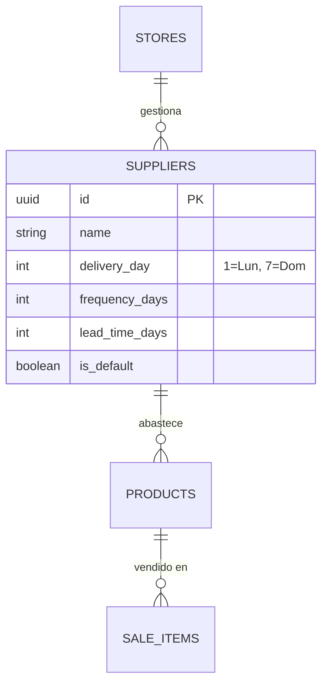

# DSD-008: Smart Supply & Proveedores

> **Basado en:** FRD-008 (Fase 2: Smart Supply)

### Explicación del Modelo
Para implementar la "Verdad Tangible" en el abastecimiento, necesitamos separar la entidad `Proveedor` del producto.
1.  **Tablas:** Se crea `suppliers` para centralizar reglas de entrega (días de visita, lead time).
2.  **Relaciones:** `products` ahora apunta a `suppliers`. Si es NULL, el RPC usará el proveedor por defecto.
3.  **Performance:** El cálculo de velocidad requiere escanear ventas pasadas. Se añade índice en `sale_items(product_id, created_at)` para evitar Full Table Scans.

### Auditoría de Esquema (Validado)
*   **Tabla `products`:** Verificado columnas `price` (Numeric, Not Null) y `current_stock` (Numeric, Nullable).
*   **Tabla `suppliers`:** No existe previamente. Se crea desde cero.
*   **Tabla `stores`:** Tiene `owner_id` FK. RLS implícito a través de `admin_profiles` y trigger seguro.
*   **Seguridad:** RPC incluye validación de autorización explícita (QA FIX #1) antes de ejecutar.

### QA Fixes Aplicados
- [x] FIX #1: Validación IDOR en RPC
- [x] FIX #2: Unique Index para `is_default`
- [x] FIX #3: COALESCE en `lead_time_days`
- [x] FIX #4: Bloque EXCEPTION para Fail-Safe

---

## Diagrama Entidad-Relación



---

## Definición de Tablas

### Tabla: `suppliers`

| Columna | Tipo | Nullable | Default | Descripción |
|---------|------|----------|---------|-------------|
| id | UUID | NO | gen_random_uuid() | PK |
| store_id | UUID | NO | | FK -> stores |
| name | TEXT | NO | | Nombre del proveedor |
| delivery_day | INT | YES | NULL | 1=Lunes ... 7=Domingo |
| frequency_days | INT | NO | 7 | Cada cuánto pasa (días) |
| lead_time_days | INT | NO | 1 | Días desde pedido a entrega |
| is_default | BOOL | NO | false | Si es el proveedor "general" |
| created_at | TIMESTAMPTZ | NO | now() | |

---

## Políticas RLS

### Política: `suppliers_policy`
- **Operación:** ALL (Select, Insert, Update, Delete)
- **Condición:** `store_id = (SELECT store_id FROM employees WHERE id = auth.uid())`
- **Justificación:** Los empleados solo ven proveedores de su tienda. (O usar función `get_my_store_id()` si existe).

---

## RPCs / Funciones

### Función: `get_smart_supply_report`
- **Parámetros:** `p_store_id UUID`
- **Retorno:** Table (jsonb)
- **Lógica:**
    1. Obtiene lista de productos activos.
    2. Para cada uno, calcula `velocity` = (SUM(qty) / NULLIF(days_with_stock, 0)).
    3. Calcula `doi` (Days of Inventory) = `current_stock / velocity`.
    4. Determina `critical_threshold` = `next_delivery_days + lead_time + safety_margin`.
    5. Retorna estructura para Tarjetas de Acción.

---

## Script SQL Completo

```sql
-- 1. Crear Tabla Suppliers
CREATE TABLE IF NOT EXISTS public.suppliers (
    id UUID PRIMARY KEY DEFAULT gen_random_uuid(),
    store_id UUID NOT NULL REFERENCES public.stores(id) ON DELETE CASCADE,
    name TEXT NOT NULL,
    delivery_day INTEGER CHECK (delivery_day BETWEEN 1 AND 7),
    frequency_days INTEGER NOT NULL DEFAULT 7,
    lead_time_days INTEGER NOT NULL DEFAULT 1,
    is_default BOOLEAN NOT NULL DEFAULT FALSE,
    created_at TIMESTAMPTZ DEFAULT now(),
    updated_at TIMESTAMPTZ DEFAULT now()
);

-- [QA FIX #2] Única Proveedor Default por Tienda
CREATE UNIQUE INDEX IF NOT EXISTS idx_suppliers_unique_default 
ON public.suppliers (store_id) 
WHERE is_default = TRUE;

-- 2. RLS para Suppliers
ALTER TABLE public.suppliers ENABLE ROW LEVEL SECURITY;

CREATE POLICY "Users can view suppliers of their store"
ON public.suppliers FOR SELECT
USING (store_id IN (
    SELECT store_id FROM public.employees WHERE auth_user_id = auth.uid()
));

CREATE POLICY "Admins can manage suppliers"
ON public.suppliers FOR ALL
USING (store_id IN (
    SELECT store_id FROM public.employees 
    WHERE auth_user_id = auth.uid() AND role = 'admin'
));

-- 3. Modificar Products
ALTER TABLE public.products 
ADD COLUMN IF NOT EXISTS supplier_id UUID REFERENCES public.suppliers(id) ON DELETE SET NULL;

-- 4. Trigger Proveedor por Defecto
CREATE OR REPLACE FUNCTION public.create_default_supplier()
RETURNS TRIGGER AS $$
BEGIN
  INSERT INTO public.suppliers (store_id, name, frequency_days, lead_time_days, is_default)
  VALUES (NEW.id, 'Proveedor General', 7, 1, TRUE);
  RETURN NEW;
END;
$$ LANGUAGE plpgsql SECURITY DEFINER;

DROP TRIGGER IF EXISTS trg_create_default_supplier ON public.stores;
CREATE TRIGGER trg_create_default_supplier
AFTER INSERT ON public.stores
FOR EACH ROW EXECUTE FUNCTION public.create_default_supplier();

-- 5. Índice de Rendimiento (Crucial para Velocidad)
CREATE INDEX IF NOT EXISTS idx_sale_items_product_date
ON public.sale_items (product_id, created_at DESC);

-- 6. RPC: Smart Supply Report
CREATE OR REPLACE FUNCTION public.get_smart_supply_report(p_store_id UUID)
RETURNS TABLE (
    product_id UUID,
    product_name TEXT,
    current_stock NUMERIC,
    velocity NUMERIC,
    doi NUMERIC,
    revenue_at_risk NUMERIC, -- [NEW] Para UX 'Loss Aversion'
    status TEXT, -- 'OK', 'WARNING', 'CRITICAL', 'REPRESSED', 'UNKNOWN'
    suggestion TEXT
) AS $$
DECLARE
    v_window_days INT := 30;
BEGIN
    -- [QA FIX #1] Validación de Autorización (Previene IDOR)
    IF NOT EXISTS (
        SELECT 1 FROM public.employees 
        WHERE store_id = p_store_id 
        AND (auth_user_id = auth.uid() OR id = auth.uid())
    ) AND NOT EXISTS (
        SELECT 1 FROM public.admin_profiles WHERE id = auth.uid()
    ) THEN
        RAISE EXCEPTION 'Acceso no autorizado a store_id: %', p_store_id;
    END IF;

    RETURN QUERY
    WITH sales_stats AS (
        -- Calcular velocidad excluyendo días sin stock (Simplificado para MVP)
        SELECT 
            si.product_id,
            SUM(si.quantity) as total_sold,
            COUNT(DISTINCT DATE(si.created_at)) as days_sold
        FROM sale_items si
        JOIN sales s ON si.sale_id = s.id
        WHERE s.store_id = p_store_id
        AND s.created_at >= (NOW() - (v_window_days || ' days')::INTERVAL)
        GROUP BY si.product_id
    ),
    product_calc AS (
        SELECT 
            p.id,
            p.name,
            p.current_stock,
            p.price, -- Necesario para calcular pérdida
            COALESCE(ss.total_sold, 0) as total_sold,
            COALESCE(ss.total_sold, 0) / NULLIF(v_window_days, 0) as velocity,
            COALESCE(sup.frequency_days, 7) as frequency_days, -- [QA FIX #3] Default si no hay supplier
            COALESCE(sup.lead_time_days, 1) as lead_time_days  -- [QA FIX #3] Default si no hay supplier
        FROM products p
        LEFT JOIN suppliers sup ON p.supplier_id = sup.id
        LEFT JOIN sales_stats ss ON p.id = ss.product_id
        WHERE p.store_id = p_store_id
    )
    SELECT 
        pc.id,
        pc.name,
        pc.current_stock,
        pc.velocity,
        CASE WHEN pc.velocity > 0 THEN pc.current_stock / pc.velocity ELSE 999 END as doi,
        -- Cálculo de Riesgo: (Velocidad * Precio) * (Días de desabastecimiento estimado)
        -- Si DOI < LeadTime, asumimos pérdida por los días faltantes
        -- [AUDIT /data]: Se usa COALESCE para evitar NULLs en stock/precio.
        CASE 
            WHEN (COALESCE(pc.current_stock, 0) / NULLIF(pc.velocity, 0)) < pc.lead_time_days 
            THEN (pc.lead_time_days - (COALESCE(pc.current_stock, 0) / pc.velocity)) * pc.velocity * COALESCE(pc.price, 0)
            ELSE 0 
        END as revenue_at_risk,
        'UNKNOWN'::text as status, 
        'Recopilando datos...'::text as suggestion
    FROM product_calc pc;

-- [QA FIX #4] Bloque de Excepción para Fail-Safe
EXCEPTION WHEN OTHERS THEN
    RAISE WARNING 'Error en Smart Supply Report: %', SQLERRM;
    RETURN; -- Retorna vacío en lugar de romper
END;
$$ LANGUAGE plpgsql SECURITY DEFINER;
```
