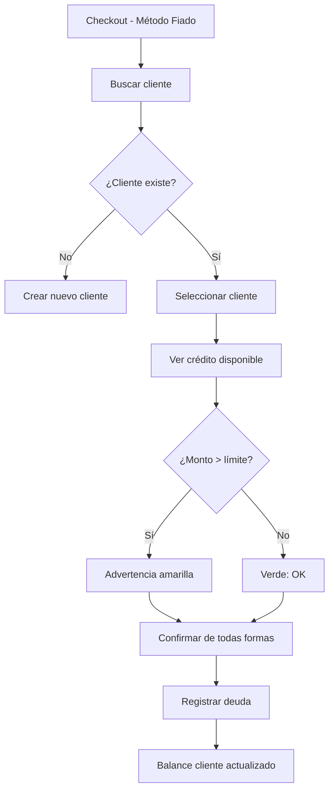

# 01 - Flujos de Usuario (User Flows)

> **Propósito:** Documentar el camino paso a paso que sigue el usuario para completar tareas clave.

---

## 🚀 UF-01: Onboarding (Registro de Tienda)

```mermaid
flowchart TD
    A[Pantalla Login] --> B{¿Tiene cuenta?}
    B -->|No| C[Click "Crea tu tienda"]
    C --> D[/register-store/]
    D --> E[Ingresar nombre tienda]
    E --> F[Ingresar nombre dueño]
    F --> G[Ingresar email]
    G --> H[Crear contraseña]
    H --> I[Crear PIN 6 dígitos]
    I --> J{Validación OK?}
    J -->|Sí| K[Tienda creada ✅]
    K --> L[Redirige a /login]
    J -->|No| M[Mostrar error]
    M --> E
```

### Pasos Detallados

| # | Acción Usuario | Validación | Feedback Visual |
|---|----------------|------------|-----------------|
| 1 | Ingresa nombre tienda | Mín. 3 caracteres | ✅ Check verde |
| 2 | Ingresa nombre dueño | Requerido | - |
| 3 | Ingresa email | Formato válido | Error si duplicado |
| 4 | Crea contraseña | Mín. 6 caracteres | - |
| 5 | Crea PIN seguridad | Exactamente 6 dígitos | Teclado numérico |
| 6 | Click "Abrir mi Tienda" | Todo válido | Spinner → Redirect |

---

## 🔐 UF-02: Autenticación

### UF-02a: Login como Admin

```mermaid
flowchart LR
    A[Pantalla Login] --> B[Ingresa email]
    B --> C[Ingresa contraseña]
    C --> D[Click "Ingresar"]
    D --> E{¿Credenciales válidas?}
    E -->|Sí| F[Dashboard /]
    E -->|No| G[Intenta como Empleado]
```

### UF-02b: Login como Empleado

```mermaid
flowchart LR
    A[Pantalla Login] --> B[Ingresa username]
    B --> C[Ingresa PIN 4 dígitos]
    C --> D[Click "Ingresar"]
    D --> E{¿PIN válido?}
    E -->|Sí| F[Dashboard /]
    E -->|No| G[Error "Credenciales inválidas"]
```

### Cascada de Validación

```
1. ¿Existe tienda? → No → Error "No se detecta tienda"
2. ¿Es Admin? → Sí → loginAsAdmin()
3. ¿Es Empleado? → Sí → loginAsEmployee()
4. Error genérico
```

---

## 🛒 UF-03: Venta Completa (POS → Checkout)

```mermaid
flowchart TD
    A[Dashboard] --> B[Click "Vender" o BottomNav]
    B --> C{Guards de acceso}
    C -->|Sin permiso| D[Overlay "No tienes permiso"]
    C -->|Tienda cerrada| E[Overlay "Tienda Cerrada"]
    C -->|OK| F[/pos/]
    
    F --> G[Ingresa PLU en numpad]
    G --> H[Click "AGREGAR"]
    H --> I{¿Producto existe?}
    I -->|No| J[Error "No encontrado"]
    I -->|Sí| K[Producto en carrito]
    
    K --> L{¿Más productos?}
    L -->|Sí| G
    L -->|No| M[Click "COBRAR"]
    
    M --> N[CheckoutModal]
    M --> N[CheckoutModal]
    N --> O{Saldo > 0?}
    O -->|No| P[Habilitar Botón Confirmar]
    O -->|Sí| Q[Formulario Agregar Pago]
    
    Q --> R{Método}
    R -->|Efectivo| S[Monto (auto-restante)]
    R -->|Nequi| T[Monto (máx restante) + Ref]
    R -->|Fiado| U[Seleccionar Cliente + Monto]
    
    S --> V[Click Agregar (+)]
    T --> V
    U --> V
    
    V --> W[Lista de Pagos Actualizada]
    W --> O
    
    P --> X[Click "Confirmar Pago"]
    X --> Y[Venta registrada ✅]
    Y --> Z[Carrito limpio]
    Z --> F
```

### Estados de Notificación

| Evento | Tipo | Mensaje |
|--------|------|---------|
| Producto agregado | Success | "3x Arroz agregado" |
| PLU no encontrado | Error | "Producto no encontrado: XXX" |
| Venta exitosa | Success | "Ticket #123 confirmado" |
| Venta offline | Warning | "Ticket guardado offline" |

---

## 📦 UF-04: Gestión de Inventario

```mermaid
flowchart TD
    A[Dashboard] --> B[Click "Productos"]
    B --> C[/inventory/]
    
    C --> D{Acción}
    D -->|Buscar| E[Input búsqueda]
    D -->|Filtrar| F[Tags de categoría]
    D -->|Crear| G[FAB + → Modal Producto]
    D -->|Editar| H[Click tarjeta → Modal]
    D -->|Eliminar| I[Confirmación → Borrar]
    D -->|Stock| J[FAB → /stock-entry/]
    
    G --> K[Llenar formulario]
    K --> L{¿Pesable?}
    L -->|Sí| M[Seleccionar unidad: kg/lb/g]
    L -->|No| N[Unidad: un]
    M --> O[Guardar]
    N --> O
```

### Formulario de Producto

| Campo | Tipo | Requerido | Validación |
|-------|------|-----------|------------|
| Nombre | text | ✅ | No vacío |
| Marca | text | ❌ | Autocompletado |
| PLU | number | ❌ | Máx. 4 dígitos |
| Categoría | select | ❌ | Lista + Custom |
| Precio | number | ✅ | > 0 |
| Costo | number | ❌ | - |
| Stock actual | number | ❌ | ≥ 0 |
| Stock mínimo | number | ❌ | ≥ 0 |

---

## 💰 UF-05: Control de Caja

### UF-05a: Apertura de Jornada

```mermaid
flowchart LR
    A[Dashboard - Tienda Cerrada] --> B[Deslizar toggle]
    B --> C[Modal "Iniciar Jornada"]
    C --> D[Ingresar base en caja]
    D --> E[Click "CONFIRMAR APERTURA"]
    E --> F[Tienda Abierta ✅]
    F --> G[Banner verde "ABIERTO"]
```

### UF-05b: Cierre de Jornada

```mermaid
flowchart TD
    A[Dashboard - Tienda Abierta] --> B[Click toggle cierre]
    B --> C[Redirige /cash-control]
    
    C --> D[Ver resumen del día]
    D --> E[Base inicial]
    D --> F[Ventas efectivo]
    D --> G[Ventas Nequi]
    D --> H[Ventas fiado]
    D --> I[Gastos]
    
    J[Ingresar conteo real] --> K[Ver diferencia]
    K --> L{Diferencia}
    L -->|Positiva| M[Verde: Sobrante]
    L -->|Negativa| N[Rojo: Faltante]
    L -->|Cero| O[Gris: Cuadrado]
    
    M --> P[Click "Cerrar Caja"]
    N --> P
    O --> P
    P --> Q[Tienda Cerrada ✅]
    Q --> R[Gastos limpiados]
    R --> S[Dashboard]
```

---

## 💳 UF-06: Sistema de Crédito (Fiado)



### Gestión de Deudas

```mermaid
flowchart LR
    A[/clients/] --> B[Click cliente]
    B --> C[/clients/:id]
    C --> D[Ver historial]
    C --> E[Registrar abono]
    E --> F[Balance reducido]
```

---

## 📊 Matriz de Flujos por Persona

| Flujo | Admin | Empleado (permisos) |
|-------|-------|---------------------|
| UF-01 Onboarding | ✅ | ❌ |
| UF-02 Login | ✅ | ✅ |
| UF-03 Venta | ✅ | `canSell` |
| UF-04 Inventario | ✅ | `canViewInventory` |
| UF-05 Caja | ✅ | ❌ |
| UF-06 Fiado | ✅ | `canFiar` |
