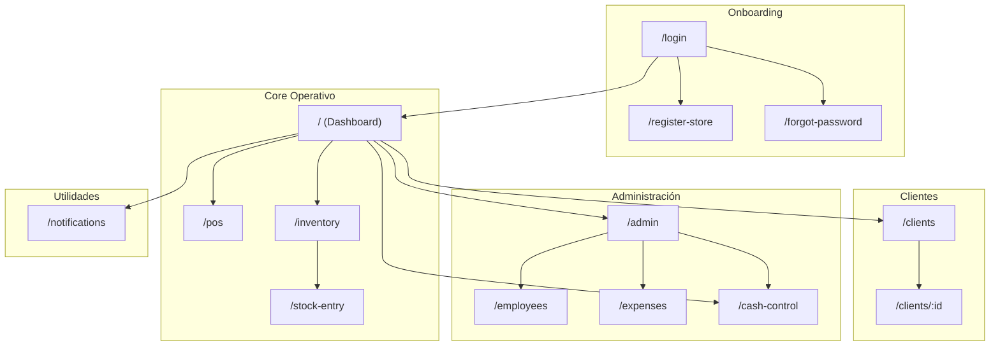
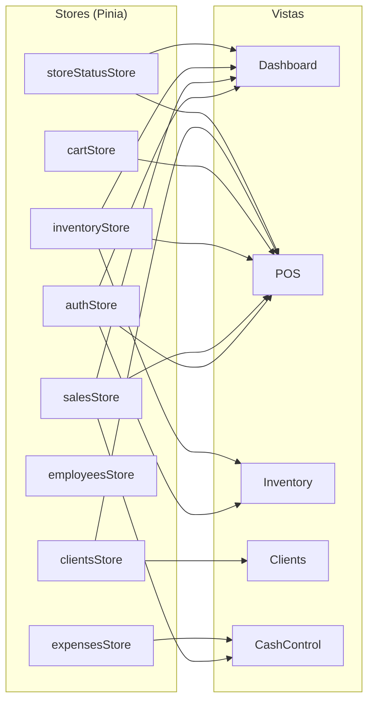

# 02 - Arquitectura de Información

> **Propósito:** Definir cómo se organiza el contenido y la navegación en la aplicación.

---

## 🗺️ Mapa de Navegación Global



---

## 📱 Jerarquía de Navegación

### Nivel 0: Autenticación
```
/login ─────────────────┐
├── /register-store     │ Flujo de onboarding
└── /forgot-password    │
```

### Nivel 1: Dashboard (Hub Principal)
```
/ (Dashboard) ──────────────────────────────────────────────────┐
├── Header: Logo + Notificaciones 🔔                            │
├── Toggle Apertura/Cierre de Tienda                           │
├── StatCards: [Caja] [Ventas] [Por Cobrar] [Inventario]       │
├── Accesos Rápidos: [Productos] [Ver Más →]                   │
├── Gestión Tienda (Admin only): [Empleados] [Configuración]   │
└── BottomNav: [🏠] [🛒] [📦] [👥] [⚙️]                        │
```

### Nivel 2: Vistas Principales
```
/pos ───────────────────┐
├── Header ← + Título   │
├── Lista Carrito       │ Área de trabajo principal
├── Numpad + Acciones   │
└── Botón COBRAR        │

/inventory ─────────────┐
├── Header + Búsqueda   │
├── Filtros Categoría   │
├── Lista Productos     │ Scroll virtual
└── FABs [+] [📥]       │

/clients ───────────────┐
├── Header + Búsqueda   │
├── Lista Clientes      │
└── FAB [+]             │
```

### Nivel 3: Detalle / Subvistas
```
/clients/:id ───────────┐
├── Info Cliente        │
├── Balance + Límite    │
├── Historial           │
└── Acciones [Abono]    │

/stock-entry ───────────┐
├── Selección Producto  │
├── Cantidad            │
└── Confirmar           │
```

---

## 🧭 Componentes de Navegación

### BottomNav (Navegación Inferior)

| Posición | Icono | Label | Ruta | Visible |
|----------|-------|-------|------|---------|
| 1 | 🏠 home | Inicio | `/` | Siempre |
| 2 | 🛒 shopping_cart | Vender | `/pos` | Siempre |
| 3 | 📦 inventory_2 | Productos | `/inventory` | Siempre |
| 4 | 👥 people | Clientes | `/clients` | Siempre |
| 5 | ⚙️ settings | Admin | `/admin` | Solo Admin |

### Header Global

```
┌─────────────────────────────────────────────────┐
│ [←]  Título de Pantalla              [🔔] [👤] │
└─────────────────────────────────────────────────┘
```

- **← (Back)**: Visible solo en vistas de nivel 2+
- **🔔 (Notificaciones)**: Badge con contador
- **👤 (Perfil)**: Abre UserProfileSidebar

---

## 📂 Taxonomía de Categorías

### Categorías de Productos (Predefinidas)

| Categoría | Icono | Uso Estimado |
|-----------|-------|--------------|
| General | 📦 | Default |
| Alimentos | 🍎 | Alto |
| Bebidas | 🥤 | Alto |
| Lácteos | 🥛 | Medio |
| Carnes | 🥩 | Medio |
| Aseo | 🧴 | Medio |
| Papelería | 📝 | Bajo |
| *Personalizada* | ➕ | Usuario define |

### Categorías de Gastos

| Categoría | Icono | Ejemplo |
|-----------|-------|---------|
| Servicios | 💡 | Luz, agua |
| Proveedores | 🚚 | Compras |
| Transporte | 🚗 | Fletes |
| Salarios | 💵 | Empleados |
| Otro | 📌 | Varios |

---

## 🔀 Flujo de Datos por Pantalla



---

## 📋 Estructura de Menús

### Menú Admin Hub (`/admin`)

```
┌─────────────────────────────────────┐
│ TABS: [Reportes] [Gestión]          │
├─────────────────────────────────────┤
│ Tab Reportes:                       │
│ ├── Ventas Hoy / Semana / Mes       │
│ └── Desglose por método de pago     │
├─────────────────────────────────────┤
│ Tab Gestión:                        │
│ ├── Control de Caja → /cash-control │
│ ├── Gastos del Día → /expenses      │
│ ├── Empleados → /employees          │
│ ├── Configuración (parcial)         │
│ ├── Dispositivos Autorizados (WIP)  │
│ ├── Historial de Ventas (WIP)       │
│ └── Toggle Cerrar Tienda            │
└─────────────────────────────────────┘
```

### Menú Sidebar Usuario

```
┌─────────────────────────────────────┐
│ [Avatar]                            │
│ Nombre Usuario                      │
│ Rol: Admin / Empleado               │
├─────────────────────────────────────┤
│ Tienda: [Nombre Tienda]             │
├─────────────────────────────────────┤
│ [🚪 Cerrar Sesión]                  │
└─────────────────────────────────────┘
```

---

## 📐 Responsive Breakpoints

| Breakpoint | Ancho | Disposición |
|------------|-------|-------------|
| Mobile | < 640px | Stack vertical, BottomNav |
| Tablet | 640-1024px | 2 columnas, BottomNav |
| Desktop | > 1024px | Sidebar + contenido, TopNav |

> [!IMPORTANT]
> **Mobile-First**: El diseño base es para 375px de ancho. Las expansiones a tablet/desktop son progresivas.
