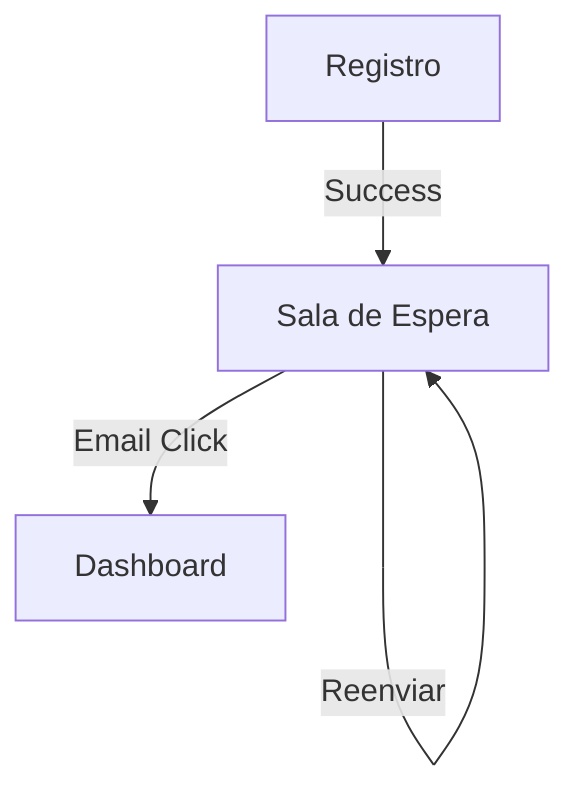

# UXD-002: Sala de Espera (Verificación de Email)

> **Basado en:** FRD-002 (Flujo Nativo)
> **Rol:** Diseñador UX/UI

### Mapa de Navegación

---

## Pantallas

### Pantalla: `WaitingRoomView`
- **Ruta:** `/auth/waiting-verification`
- **Acceso:** Público (pero diseñada para usuarios con sesión parcial)

#### Estructura Visual (Centrado / Minimalista)

1.  **Icono Hero:** Sobre/Email abierto (Animación sutil).
2.  **Título:** "Revisa tu bandeja de entrada".
3.  **Cuerpo:**
    *   "Hemos enviado un enlace de confirmación a **[email_usuario]**."
    *   "Para activar tu tienda, haz clic en ese enlace."
4.  **Acciones Primarias:**
    *   Botón (Si es Gmail): "Abrir Gmail" (Color Rojo Google).
    *   Botón (Genérico): "Abrir Correo" (`mailto:`).
5.  **Acciones Secundarias (Texto):**
    *   "¿No llegó? **Reenviar correo**" (Link, deshabilita 60s).
    *   "¿Te equivocaste? **Cerrar sesión**".

#### Estados de la Interfaz

| Estado | Comportamiento Visual | Feedback al Usuario |
|--------|-----------------------|---------------------|
| **Idle** | Estático, esperando acción del usuario | - |
| **Sending** | Spinner en link "Reenviar" | "Enviando..." |
| **Success** | Check verde en link "Reenviar" | "¡Correo enviado!" |
| **Error** | Texto rojo pequeño | "Espera X segundos" |
| **Detected** | (Opcional) Si detectamos verificación en otra tab | "¡Verificado! Redirigiendo..." |

---

## Lógica de Componentes

### 1. Detección de Estado (`useAuthStore`)
El componente debe consultar periódicamente (polling cada 3s) o escuchar eventos de `onAuthStateChange` para saber si el usuario ya verificó el correo (caso Cross-Device).

### 2. Botón Reenviar
- **Lógica:** Llama a `supabase.auth.resend()`.
- **Restricción:** Debe implementar un contador regresivo local de 60 segundos para evitar spam (UX friendly, aunque Supabase tenga rate limit).

### 3. Protección de Ruta
Esta pantalla NO debe tener Header de navegación ni Sidebar. Es un "Callejón sin salida" hasta verificar.

---

## Instrucción para el Orquestador
Construir un componente Vue limpio, usando Tailwind para el centrado absoluto. Usar iconos de `lucide-vue-next` (`Mail`, `Check`, `Loader`).
