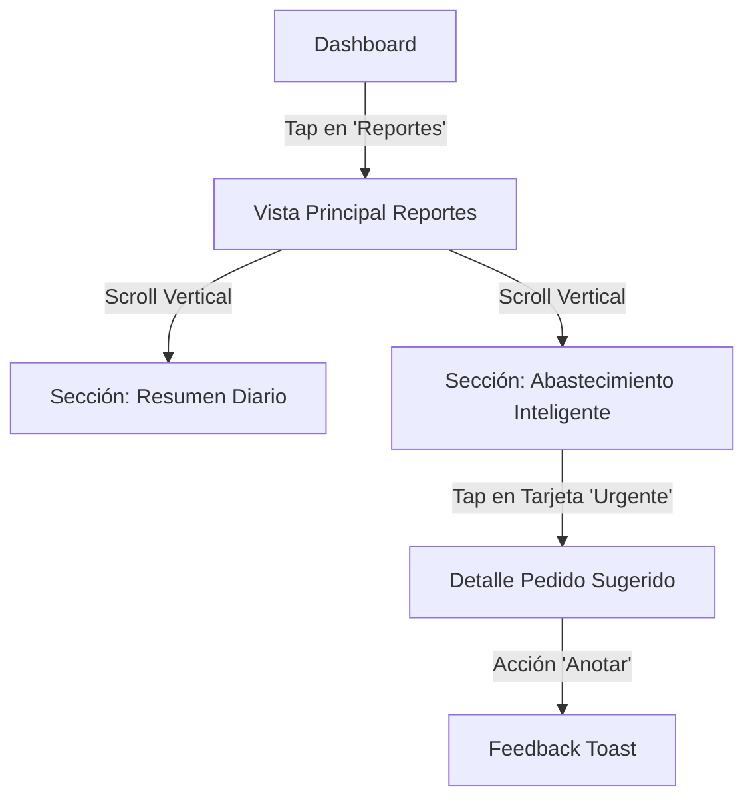

# UXD-008: Reportes & Smart Supply

> **Basado en:** FRD-008 (Reportes v2)
> **Principio Rector:** "Inteligencia que Calma + Impacto Financiero"

### Estrategia de Hábito ("El Gancho")
Para usuarios con cero hábito administrativo, la "suavidad" no basta. Necesitamos activar la **Aversión a la Pérdida** (Loss Aversion).
1.  **Monetizar el Problema:** No digas "Stock Bajo". Di **"Estás arriesgando $50.000 de venta"**.
2.  **Ritual de Cierre:** El reporte no es una consulta, es un **Cierre del Día**. Debe dar una sensación de "Tarea Cumplida".
3.  **Racha de Control:** Gamificar la consistencia. "Llevas 5 días seguidos con tu negocio bajo control".

---

## Mapa de Navegación

---

## Pantallas

### Pantalla: Reportes Principales (`ReportsView.vue`)
- **Ruta:** `/reports`
- **Acceso:** Admin y Empleado con Permisos.

#### Estructura Visual
1.  **Header:** Título "Mi Negocio" + Fecha Actual.
2.  **Sección 1: Resumen del Día (`SmartDailySummary`)**
    *   (Diseño existente: Semáforo, Número Héroe, Desglose).
    *   *Cambio:* Se elimina la lógica de alertas de stock antigua si entraba en conflicto.
3.  **Sección 2: Cerebro de Abastecimiento (`SmartSupplySection`)**
    *   **Título:** "Sugerencias de Compra" (Icono: 🧠 o 📦)
    *   **Contenido:** Carrusel vertical de **Action Cards**.

---

## Componentes Críticos

### Componente: `SmartSupplySection`

#### Estado A: Cargando (Loading)
*   **Visual:** 3 Tarjetas rectangulares grises con efecto "shimmer" (brillo).
*   **Texto:** "Analizando tus ventas..."

#### Estado B: Sin Datos / Aprendiendo (Empty/Learning)
*   **Condición:** Productos con < 15 días de historia.
*   **Visual:** Icono de "Lupa" o "Robot amigable".
*   **Texto:** "Aún estoy aprendiendo de tus ventas. Vuelve en unos días para ver sugerencias mágicas."
*   **Color:** Gris neutro (Background suave).

#### Estado C: Todo en Orden (Recompensa de Dopamina)
*   **Condición:** No hay alertas urgentes.
*   **Tarjeta Única (Racha):**
    *   **Visual:** Llama (🔥) o Escudo (🛡️) animado.
    *   **Título:** "¡Negocio Blindado!"
    *   **Subtítulo:** "Llevas **5 días seguidos** sin perder ventas. Sigue así."
    *   **Fondo:** Verde degradado premium.

#### Estado D: Alertas de Alto Impacto (Loss Aversion)

Las tarjetas deben **doler** en el bolsillo para obligar a la acción.

| Tipo de Tarjeta | Color | Icono | Estructura de Texto (Copywriting) | Acción Principal |
|-----------------|-------|-------|-----------------------------------|------------------|
| **Riesgo Monetario** | 🔴 Rojo | � | **Título:** ¡Riesgo de $45.000! **Cuerpo:** "Si no pides *Arroz* hoy, perderás ventas el fin de semana." | Botón: "Pedir Ya" |
| **Dinero Perdido** | 🔵 Azul | 📉 | **Título:** Ya perdiste $12.000 **Cuerpo:** "*Pan* se agotó ayer a las 4pm. No dejes que pase hoy." | Botón: "Solucionar" |
| **Advertencia** | 🟡 Amarillo | ⚠️ | **Título:** Prepárate **Cuerpo:** "El Martes llega *Lácteos*. Ve separando $200.000." | (Sin botón) |

---

## Detalle de Interacción: Asignación Masiva
**Para evitar el miedo a configurar 500 productos.**

*   **Disparador:** Alerta "Tienes 50 productos sin proveedor".
*   **Modal:** `BulkSupplierAssign`
*   **Diseño:**
    1.  Lista simple de productos (Checkboxes).
    2.  Filtro por categoría (ej: "Lácteos").
    3.  Select inferior: "¿Quién te trae esto?" [Lista Proveedores].
    4.  Botón Grande: "Guardar Asociación".

---

## Guía de Estilo Funcional

| Elemento | Especificación Visual | Psicología |
|----------|-----------------------|------------|
| **Tarjeta Roja** | Fondo: `#FFF5F5`, Borde: `#FC8181`, Texto: `#C53030` | Urgencia, pero no "Error Fatal". Es una ayuda, no un regaño. |
| **Tarjeta Verde** | Fondo: `#F0FFF4`, Borde: `#68D391`, Texto: `#276749` | Recompensa. Genera dopamina por tener el negocio ordenado. |
| **Tipografía** | Sans-serif, Tamaños grandes (16px cuerpo, 20px títulos) | Legibilidad máxima para usuario en movimiento. |
| **Animación** | Las tarjetas entran suavemente (`fade-up`). | Sensación de fluidez y modernidad. |

---

## Instrucción para el Orquestador

1.  **Frontend:** Implementar `SmartSupplySection.vue` usando **Slots** para flexibilidad.
2.  **Lógica:** La "inteligencia" del texto (ej: "se acaba mañana") viene del Backend (RPC). El Frontend solo renderiza el string `suggestion`. No calcular fechas en JS.
3.  **Iconos:** Usar `Lucide-Vue` (iconos consistentes y limpios).
