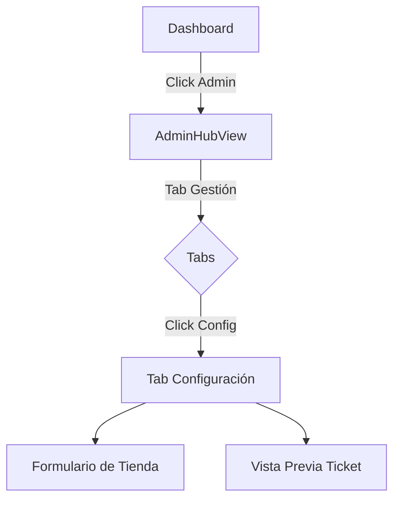

# Diseño UX/UI - Módulo de Configuración de Tienda

> **ID**: UI-PHASE4-001  
> **Fecha**: 2026-01-21  
> **Estado**: 📋 Definición

---

## 1. Mapa de Navegación

El módulo vive dentro del **AdminHub**, accesible solo para administradores.



---

## 2. Detalle de Pantalla (Tab Configuración)

Ubicación: `src/views/AdminHubView.vue` -> Nuevo componente `StoreConfigTab.vue` (o integrado).

### Estructura Visual
Diseño en 2 columnas (Desktop) o Stack (Mobile):

#### Columna Izquierda: Formulario de Datos
1.  **Card: Identidad Visual**
    *   **Logo de Tienda**: Input tipo File (acepta imágenes) o URL. Muestra preview circular.
    *   **Nombre de la Tienda**: Input texto (Requerido). Ej: "Tienda Don Pepe".

2.  **Card: Datos Fiscales**
    *   **NIT / Cédula**: Input numérico. Ej: "900.123.456-7".
    *   **Régimen**: Selector (Común / Simplificado / No Responsable).
    *   **Dirección / Teléfono**: Inputs opcionales para el pie de página.

3.  **Card: Personalización de Ticket**
    *   **Mensaje Final**: Textarea. Ej: "¡Gracias por su compra! Vuelva pronto".
    *   **Moneda**: Selector (COP, USD, MXN). Default: COP.

#### Columna Derecha: Vista Previa (Live Preview)
*   **Componente "Ticket Preview"**: Simulación visual de cómo saldrá el recibo impreso/digital.
*   Actualiza en tiempo real mientras el usuario escribe.

---

## 3. Lógica de Componentes

### `configStore.ts` (Persistencia Local)
*   **Estado**:
    ```typescript
    interface StoreConfig {
      storeName: string;
      logoUrl: string | null;
      documentId: string;
      regime: string;
      contactInfo: string;
      ticketFooter: string;
      currency: 'COP' | 'USD';
    }
    ```
*   **Acciones**:
    *   `saveConfig(config)`: Guarda en `localStorage`.
    *   `resetConfig()`: Vuelve a valores por defecto.

### `StoreConfigTab.vue` (UI)
*   **Validación**: El nombre de la tienda no puede estar vacío.
*   **Feedback**: Mostrar "Guardado exitosamente" (Toast) al hacer blur o click en "Guardar Cambios".

### `CheckoutModal.vue` (Consumidor)
*   Debe leer `configStore` para renderizar el ticket final.
*   Si no hay logo configurado, mostrar icono genérico `storefront`.

---

## 4. Instrucción para el Orquestador

1.  **Backend (Fake)**: Crear `stores/configStore.ts` primero.
2.  **Frontend**: Crear el componente `components/admin/StoreConfigForm.vue` para aislar la lógica.
3.  **Integración**: Importarlo en `AdminHubView.vue` como una nueva sección en el tab "Gestión".
