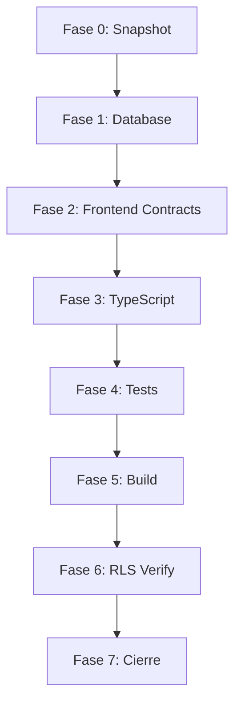

# 📐 HOJA DE RUTA: ESTABILIZACIÓN SINCRONIZADA

**Fecha:** 2026-01-31  
**Arquitecto:** Product Architect  
**Objetivo:** Corregir todos los hallazgos sin generar nuevos errores

---

## Principio Rector

> **"Primero el fundamento, luego la estructura, finalmente el acabado"**
> 
> No se puede corregir el frontend si el backend no existe.  
> No se puede verificar RLS si no hay tablas.  
> No se puede hacer build si TypeScript no compila.

---

## Diagrama de Dependencias



---

## Fase 0: Snapshot de Seguridad
**Duración:** 2 min | **Riesgo:** Ninguno

> [!IMPORTANT]
> Antes de cualquier cambio, guardar el estado actual.

```bash
git add -A
git commit -m "chore: snapshot pre-estabilización"
```

**Criterio de Éxito:** Commit creado exitosamente

---

## Fase 1: Fundación Backend (Supabase)
**Duración:** 10 min | **Riesgo:** ALTO

### 1.1 Verificar Estado Actual

```bash
# En terminal local con Supabase CLI
supabase db diff --project-ref ihtjocmhzuliwwvdzfnz
```

### 1.2 Aplicar Schema v2

**Opción A: Supabase CLI (Recomendado)**
```bash
supabase db push --project-ref ihtjocmhzuliwwvdzfnz
```

**Opción B: Dashboard Manual**
1. Ir a [Supabase Dashboard](https://supabase.com/dashboard/project/ihtjocmhzuliwwvdzfnz)
2. SQL Editor → New Query
3. Pegar contenido de `02_ARCHITECTURE/supabase-schema-v2.sql`
4. Ejecutar

### 1.3 Verificación

```sql
SELECT tablename FROM pg_tables WHERE schemaname = 'public';
-- Debe retornar: stores, employees, products, sales, etc.
```

**Criterio de Éxito:** ≥10 tablas en schema `public`

---

## Fase 2: Corrección de Contratos Frontend
**Duración:** 15 min | **Riesgo:** MEDIO

### 2.1 Corregir CashControlView.vue

**Archivo:** `src/views/CashControlView.vue`  
**Línea:** 99

```diff
- await cashRegisterStore.openRegister(
-     authStore.currentUser.id,
-     new Decimal(amount.value),
-     notes.value
- );
+ const storeId = authStore.currentStore?.id;
+ if (!storeId) {
+     showError('No hay tienda asociada. Cierra sesión e ingresa de nuevo.');
+     return;
+ }
+ await cashRegisterStore.openRegister(
+     authStore.currentUser!.id,
+     storeId,
+     new Decimal(amount.value),
+     notes.value
+ );
```

### 2.2 Verificar authStore tiene currentStore

```typescript
// Verificar en src/stores/auth.ts que existe:
currentStore: Store | null
```

**Criterio de Éxito:** Archivo guardado sin errores de sintaxis

---

## Fase 3: Compilación TypeScript
**Duración:** 20-30 min | **Riesgo:** MEDIO

### 3.1 Primera Pasada

```bash
npx tsc --noEmit 2>&1 | Select-String -NotMatch "__tests__" | Select-Object -First 20
```

### 3.2 Corregir Errores (Orden de Prioridad)

| Prioridad | Tipo de Error | Acción |
|-----------|---------------|--------|
| 1 | `storeId` faltante en vistas | Agregar desde authStore |
| 2 | `storeId` faltante en stores | Agregar a interfaces |
| 3 | Tipos incompatibles | Ajustar mappers |

### 3.3 Verificación

```bash
npx tsc --noEmit
# Debe retornar 0 errores (solo tests pueden tener errores)
```

**Criterio de Éxito:** 0 errores en código de producción

---

## Fase 4: Suite de Tests
**Duración:** 10 min | **Riesgo:** BAJO

### 4.1 Ejecutar Tests Críticos

```bash
npx vitest run src/__tests__/stores/cashRegister.spec.ts
```

### 4.2 Actualizar Mocks de Inventory (Opcional)

```typescript
// inventory.spec.ts - Agregar storeId a mocks
const mockProduct = {
    name: 'Test',
    storeId: 'test-store-id', // ← Agregar
    // ...
};
```

**Criterio de Éxito:** Tests de cashRegister pasan (18/18)

---

## Fase 5: Build de Producción
**Duración:** 5 min | **Riesgo:** BAJO

```bash
npm run build
```

**Criterio de Éxito:** Build exitoso sin errores

---

## Fase 6: Verificación RLS
**Duración:** 10 min | **Riesgo:** BAJO

### 6.1 Query de Verificación

```sql
SELECT 
    schemaname,
    tablename,
    policyname,
    cmd
FROM pg_policies 
WHERE schemaname = 'public'
ORDER BY tablename;
```

### 6.2 Checklist RLS

- [ ] `stores` tiene políticas SELECT/INSERT/UPDATE
- [ ] `employees` tiene políticas por store_id
- [ ] `products` tiene políticas por store_id
- [ ] `sales` tiene políticas por store_id

**Criterio de Éxito:** Todas las tablas tienen ≥1 política

---

## Fase 7: Cierre y Documentación
**Duración:** 5 min | **Riesgo:** Ninguno

### 7.1 Commit Final

```bash
git add -A
git commit -m "fix: estabilización completa - DB + TS + RLS"
```

### 7.2 Actualizar MAPA_RIESGOS

Cambiar puntaje de 45/100 → 85/100 (o superior)

---

## Resumen de Ejecución

| Fase | Tiempo | Bloqueante | Rollback |
|------|--------|------------|----------|
| 0 | 2 min | - | N/A |
| 1 | 10 min | ✅ Sí | git reset |
| 2 | 15 min | ✅ Sí | git checkout |
| 3 | 30 min | ✅ Sí | git checkout |
| 4 | 10 min | ❌ No | - |
| 5 | 5 min | ✅ Sí | - |
| 6 | 10 min | ❌ No | - |
| 7 | 5 min | ❌ No | - |

**Tiempo Total Estimado:** 1 hora 15 minutos

---

## Puntos de Rollback

Si algo falla en cualquier fase:

```bash
# Rollback a snapshot inicial
git reset --hard HEAD~1
```

---

## ¿Quién Ejecuta Cada Fase?

| Fase | Rol |
|------|-----|
| 0-1 | 🗄️ Data Architect |
| 2-3 | 🎨 UX/Frontend |
| 4-5 | 🔧 Orquestador |
| 6-7 | 🛡️ QA |

---

## Criterio de Aceptación Final

- [ ] 0 errores TypeScript en producción
- [ ] Build exitoso
- [ ] ≥10 tablas en Supabase
- [ ] RLS activo en todas las tablas
- [ ] Tests críticos pasan
